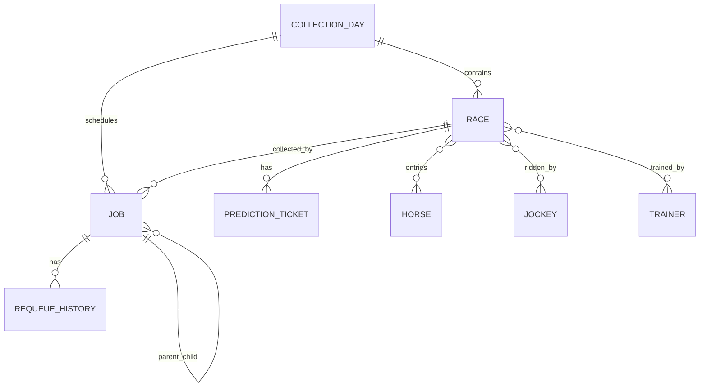
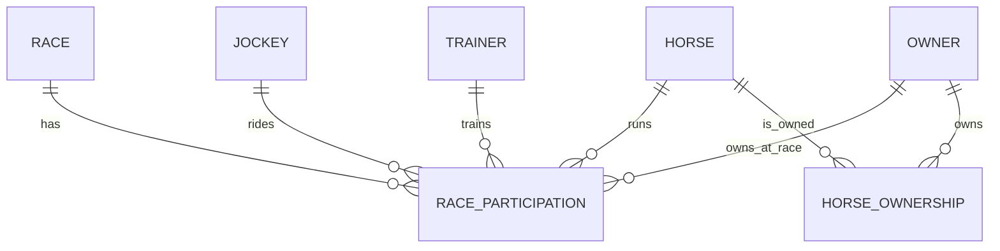
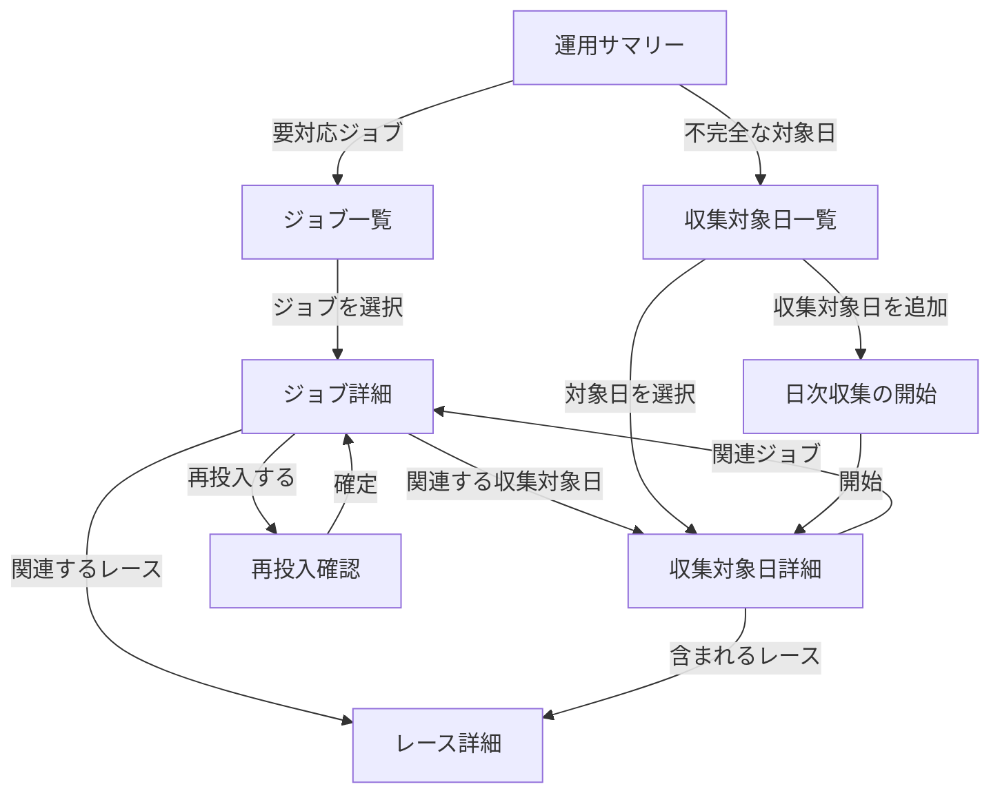

# 管理サイト UI / UX 再設計

## 1. 目的と今回の範囲

この文書は、管理サイトをスマートフォンでも「状況を把握し、原因を確認し、安全に復旧できる」画面へ再設計するための構成案である。今回は実装前の情報設計、画面遷移、API 要件、デザインシステム、Blazor 実装方針までを決める。

- レース、予想、馬、騎手、調教師の情報項目と画面間の関係は原則維持する。
- ジョブ管理は一覧中心の構成を廃止し、運用ユースケース中心に再設計する。
- `HorseRacingPrediction.Api` を管理サイトの正本とし、`HorseRacingPrediction.Collector` の画面は収集処理のデバッグ用途に限定する。
- 最小対応幅は 320 CSS px、主要なタップ対象は 44 px 以上をプロジェクト基準とする。WCAG 2.2 の最低要件は 24 x 24 CSS px である。

## 2. 現状の問題

### 2.1 直接の不具合

`CollectionTasks.razor` と Collector の `Jobs.razor` / `ResultDays.razor` は、幅の大きい `<table>` の最終列に再投入ボタンを置いている。一方、テーブルを横スクロールさせる専用コンテナがないため、スマートフォンでは右端の操作へ到達できない。

`.card` だけにはモバイル時の `overflow-x: auto` があるが、対象テーブルは `.card` に含まれていない。単にテーブルへ横スクロールを加えると操作自体は可能になるものの、キー、日時、状態、ボタンを横移動しながら読む必要が残り、運用画面としては不十分である。

### 2.2 情報設計上の問題

- 「今、対応が必要か」が一覧を読まないと分からない。
- `Failed`、`DeadLetter`、`WaitingDependency` などの意味と次の行動が表示されない。
- 再投入できる状態かに関係なく、全行に同じ操作が表示される。
- 最終エラーとペイロードは別画面または別サービスにあり、復旧判断までの経路が分断されている。
- ジョブ単体の再投入と、対象日の Discovery / Collection 再投入の違いが運用者の言葉で説明されていない。
- 同じジョブ管理 UI が API と Collector に重複し、振る舞いと表示がずれやすい。
- フィルターが実装上の値 (`JobType`, enum 名) をそのまま見せている。
- 件数上限だけでページング、総件数、状態別件数がなく、検索結果の全体像が分からない。
- 再投入の確認、理由、実行者、監査履歴がない。

## 3. 運用ユースケース

ジョブ管理は API のエンドポイント単位ではなく、次の利用目的で構成する。

1. **異常に気づく**: 失敗、デッドレター、長時間実行、依存待ちの件数と最新発生時刻を見る。
2. **影響範囲を知る**: 対象日、レース、処理種別、後続処理への影響を確認する。
3. **原因を確認する**: 人が読めるエラー要約、詳細、試行回数、ペイロード、時系列を見る。
4. **復旧方法を選ぶ**: ジョブ単体、日次 Discovery から、日次 Collection から、のいずれかを選ぶ。
5. **安全に再投入する**: 対象と副作用を確認し、二重送信を防いで実行する。
6. **復旧を追跡する**: 再投入後の新しい状態と関連ジョブを同じ画面で追跡する。
7. **正常系を調べる**: 種類、状態、対象日、更新時刻で検索し、個別ジョブを参照する。

## 4. OOUI モデル

画面や手順より先に、利用者が認識する「もの」を定義する。OOUX の ORCA（Objects, Relationships, Calls-to-Action, Attributes）を使い、ナビゲーション、URL、API、Razor コンポーネントの語彙を揃える。

### 4.1 主要オブジェクト

| オブジェクト | 識別子 / 主ラベル | 代表属性 | 関係 | オブジェクトに対する操作 |
|---|---|---|---|---|
| ジョブ | 処理名 + 対象 | 状態、試行回数、優先度、更新時刻、エラー | 収集対象日、レース、親子ジョブ、再投入履歴 | 詳細を見る、再投入する、関連ジョブを見る |
| 収集対象日 | Provider + 日付 | 予定数、完了数、状態、不完全理由、更新時刻 | 複数のジョブ、複数のレース | 詳細を見る、Discovery から収集する、収集から再開する |
| レース | 開催日 + 場 + R | 発走時刻、状態、出走数、結果有無 | 収集対象日、収集ジョブ、予想票、馬 | 詳細を見る、関連ジョブを見る |
| 予想票 | 対象レース + 作成時刻 | 状態、印、評価 | レース、馬 | 詳細を見る、編集する |
| 馬 | 登録名 | 性、生年月日、現在の馬主、別名 | 出走、レース、騎手、調教師、馬主 | 詳細を見る、出走履歴を見る、メンテナンスする |
| 騎手 | 表示名 | 所属、別名 | 騎乗、レース、馬、調教師 | 詳細を見る、騎乗履歴を見る、メンテナンスする |
| 調教師 | 表示名 | 所属、別名 | 管理出走、レース、馬、騎手 | 詳細を見る、管理馬の出走履歴を見る、メンテナンスする |
| 馬主 | 表示名 | 正規化名、別名 | 所有関係、馬、出走、レース | 詳細を見る、所有馬と成績を見る、名寄せする |
| 出走 | レース + 馬 | 枠、馬番、斤量、馬体重、着順、賞金 | 1 レース、1 馬、騎手、調教師、馬主 | 関係する各オブジェクトを見る |
| 所有関係 | 馬主 + 馬 + 期間 | 開始日、終了日、情報源、確度 | 1 馬主、1 馬 | 馬主を見る、馬を見る |
| 再投入履歴 | 実行時刻 + 実行者 | 理由、旧状態、新状態、結果 | 1 ジョブまたは 1 収集対象日 | 詳細を見る |

`JobType`、Deduplication Key、ペイロード、リースは利用者の主要オブジェクトではなく、ジョブの技術属性として詳細内へ置く。「再投入」「日次収集を開始」は独立したナビゲーション項目ではなく、対象オブジェクトの状態に応じて現れる CTA とする。

### 4.2 オブジェクトカードの共通文法

一覧項目はオブジェクトの縮約表現であり、画面ごとに別のカードを発明しない。

1. **識別**: 処理名、日付、レース名など、そのオブジェクトを一意に認識できる主ラベル
2. **状態**: 日本語ラベル + アイコン。色だけに依存しない
3. **主要属性**: 判断に必要な 2–3 項目だけ
4. **関係**: 対象日、レース、親ジョブなど、詳細へ辿れる関連オブジェクト
5. **詳細への affordance**: 項目全体または明示的な「詳細を見る」リンク

編集・再投入など状態を変える CTA は原則として詳細に置く。一覧に置くのは、低リスクで頻度が高く、誤操作しても容易に回復できる操作だけとする。

### 4.3 オブジェクト間の関係



関係は単なる文字列ではなくリンクとして表現し、どの詳細からでも関連オブジェクトへ移動できるようにする。戻る操作に依存した一本道ではなく、オブジェクト同士を辿れる構造にする。

## 5. 推奨する情報アーキテクチャ

管理サイトの主ナビゲーションをオブジェクト名で次の 3 グループに整理する。

- **レース**: レース、予想票
- **データ**: 馬、騎手、調教師、馬主
- **運用**: ジョブ、収集対象日

デスクトップでは左サイドバー、720 px 以下では上部アプリバーとドロワーメニューを使用する。モバイルで全メニューを常時折り返して表示しない。画面内のローカルナビゲーションはタブまたはセグメントに分ける。

### 5.1 ジョブ一覧 `/jobs`

ジョブオブジェクトのコレクションを運用の標準入口とする。初期状態は「要対応」の保存ビューだが、ページ自体は常にジョブ一覧であり、別の失敗ジョブ画面は作らない。

- 保存ビュー: 要対応、処理中、最近完了、すべて
- 詳細フィルター: 処理種別、状態、収集対象日、更新期間、キー
- デスクトップ: 選択したジョブの概要を右ペインへ表示する list-detail。URL は選択ジョブを表す
- モバイル: 1 ジョブ 1 リスト項目。選択すると詳細へ全画面遷移する
- ブラウザーの戻る操作でビュー、フィルター、並び順、スクロール位置を復元する
- 状態変更操作は一覧に置かず、詳細を開いてから実行する

### 5.2 ジョブ詳細 `/jobs/{jobId}`

ジョブオブジェクトの正規の詳細表現（canonical representation）であり、通知や監査ログからもこの URL へリンクする。

- ヘッダー: 状態、処理名、対象、更新時刻
- 主属性: エラー要約、試行回数、次回実行時刻
- 関係: 収集対象日、レース、親ジョブ、子ジョブ、再投入履歴
- 履歴: 投入、開始、失敗、再投入の時系列
- 技術属性: Job ID、JobType、Deduplication Key、ペイロード、優先度、リース（折りたたみ）
- CTA: 状態に応じた `再投入する`。不可能な場合は非表示ではなく、必要な場面では理由を説明する

### 5.3 収集対象日一覧 `/collection-days`

日次収集をジョブの集合ではなく、利用者が理解しやすい「JRA のある日付の収集」として表現する。

- 日付ごとの状態、予定レース数、完了レース数、不完全理由
- 日付を選ぶと収集対象日詳細へ遷移
- 新しい対象日の収集開始は、このコレクションにオブジェクトを追加する CTA として一覧ヘッダーに置く

### 5.4 収集対象日詳細 `/collection-days/{provider}/{date}`

- 収集状況と進捗
- 含まれるレース一覧
- 関連ジョブ一覧
- エラー / 不完全理由
- CTA: `発見から再収集する`、条件を満たす場合の `収集から再開する`

### 5.5 運用サマリー `/operations`（補助ユースケース）

複数オブジェクトを横断して異常に気づく必要があるため、例外的にタスク指向のサマリーを設ける。ただし、各項目は必ず保存済み一覧ビューまたはオブジェクト詳細へ遷移し、サマリー内で調査や再投入を完結させない。

- 要対応: 失敗 / デッドレター / 長時間停止
- 処理中: 実行中 / 待機中
- 最近完了: 直近 24 時間の成功
- 対象日別状況: 完了数 / 予定数、不完全理由
- 主操作: 「要対応ジョブを見る」。日次収集の開始は収集対象日一覧へ置く

### 5.6 再投入確認 `/jobs/{jobId}/requeue`

スマートフォンではボトムシート相当、デスクトップではダイアログとして表示できるが、URL を持つページとしても成立させる。

- 対象: 処理名、日付 / レース、キー
- 現在の状態と試行回数
- 実行内容: 既存ジョブを Ready に戻す、試行回数は維持する、直ちに実行候補になる
- 注意: 関連する後続処理や重複可能性
- 任意の再投入理由
- 主操作: `再投入する`、副操作: `戻る`
- 成功後は詳細へ戻し、トーストだけでなく新状態を本文に反映する

### 5.7 日次収集の開始 `/collection-days/new`

ジョブ種別や ProviderType を直接入力させず、「いつの JRA 結果を収集するか」を入力させる。

- 対象日（必須）
- 開始位置: 通常は「対象日の発見から」。既存ジョブがある場合のみ「収集から再開」を選択可能
- 実行前に既存の日次状態と影響を表示
- 完了後は対象日の状況画面へ遷移

### 5.8 レース一覧 `/races`

「検索機能」ではなく、レースオブジェクトのコレクションとして設計する。日付と開催場が強い認知軸なので、平坦な全件テーブルだけにしない。

- 保存ビュー: 今日、今週、結果確定、データ不完全、すべて
- 既定ビュー: 開催がある場合は「今日」、ない場合は直近の開催日
- グルーピング: 日付 → 開催場 → レース番号順。検索結果ではグループを維持する
- 一覧項目の識別子: `場名 + R + レース名`。日付、距離 / 馬場、頭数、状態、勝ち馬を補助属性とする
- 詳細フィルター: 開催期間、開催場、レース番号、グレード、馬場、状態、馬名
- デスクトップ: list-detail で選択したレースの概要を右ペインへ表示できる
- モバイル: 開催日と場を見出しにした縦リスト。表の横スクロールを前提にしない
- 「勝ち馬」はレース名と同列の検索欄ではなく、馬オブジェクト検索から関連レースを辿る導線も用意する

### 5.9 レース詳細 `/races/{raceId}`

レースの正規の詳細表現。レースのライフサイクルが変わっても URL と基本構造は維持し、優先順位だけを変える。

#### 常に表示する識別情報

- 日付、開催場、R、レース名
- グレード、距離、芝 / ダート、回り
- 状態と最終更新時刻
- Race ID は技術情報へ移し、主見出しには表示しない

#### 開催前（Draft / CardPublished）

1. 発走条件と最新の天候 / 馬場
2. 出走馬
3. 予想票と印の比較
4. データ充足状況と関連収集ジョブ
5. メモ、技術情報

#### レース中（InProgress）

1. 状態と最終更新時刻
2. 出走馬
3. 予想票
4. 「結果を収集中」の明確な状態表示

#### 結果確定後（ResultDeclared / PayoutDeclared / Closed）

1. 上位 3 頭と勝ち時計
2. 全着順。出走表の属性を統合し、馬番、馬、騎手、人気 / 印、着順、タイムを同じ行で比較する
3. 払戻
4. 予想と結果の比較
5. レース概況
6. 関連収集ジョブ、メモ、技術情報

ページ先頭に短いセクションナビゲーションを置き、`#entries`、`#results`、`#payouts`、`#predictions`、`#operations` へ直接リンクできるようにする。タブ切り替えで存在する情報を隠すのではなく、同一ページ内の見出しへ移動する。存在しないセクションのリンクは表示しない。

### 5.10 出走馬 / 結果行のオブジェクト表現

出走表と結果表を別々のデータ構造として見せず、`RaceEntry` をレースに参加する馬の関係オブジェクトとして扱う。

| 段階 | 主要表示 | 補助表示 |
|---|---|---|
| 開催前 | 枠 / 馬番、馬名、騎手、負担重量 | 性齢、調教師、馬体重、馬主、予想印 |
| 結果確定後 | 着順、馬番、馬名、タイム / 着差 | 騎手、上り 3F、馬体重、賞金、予想印 |

- 馬名、騎手、調教師はそれぞれのオブジェクト詳細へのリンクとする。
- 枠色は補助的に使い、枠番の数字を必ず表示する。
- モバイルでは 1 頭 1 行の優先情報を固定し、補助属性を開閉可能な詳細へ送る。横長テーブルを縮小表示しない。
- 取消、除外、中止などは着順の空欄ではなく、テキスト状態として表示する。
- 未取得値、該当なし、0 を区別する。未取得値を空文字で隠さない。

### 5.11 レースに属する操作

- `データを訂正する`: `/races/{raceId}/edit` の専用フォームへ遷移する。閲覧詳細の末尾へ常時大きな編集フォームを置かない
- `関連ジョブを見る`: ジョブ一覧の `raceId` フィルター済みビューへ遷移する
- `予想票を見る`: レースに属する予想票コレクションへ遷移する
- `メモを追加する`: レース詳細内のメモ領域で実行する

ライフサイクル進行は Collector / Predictor の責務なので、通常のレース詳細に「結果確定」などの管理コマンドを追加しない。データ訂正は主操作ではなく、権限を持つ利用者向けの補助操作としてオーバーフローメニューまたは技術情報領域に置く。

### 5.12 人馬関係の中心: 出走オブジェクト

馬・騎手・調教師・馬主を直接すべて結ぶのではなく、ある時点の事実を表す `RaceParticipation`（現在の `Entry` / `EntryResult`）を中心にする。



騎手と馬、調教師と馬、馬主と馬の関係は時間で変わる。したがって、次を区別する。

- **レース時点の関係**: 出走に記録された騎手、調教師、馬主。過去の事実として変更しない
- **現在の関係**: 現在の馬主など、プロフィールまたは期間付き関係から得る
- **最近の関係**: 最新出走から推測しただけの情報。「現在の調教師」と断定せず「直近出走の調教師」と表示する

現在の `OwnerName` は馬プロフィールと出走の文字列属性であり、馬主 ID がない。馬主をリンク可能にするには独立した Owner オブジェクトと名寄せが必要である。表示名だけから毎回関係を推測しない。

### 5.13 馬詳細 `/horses/{horseId}`

1. 登録名、性齢、生年月日、現在の馬主
2. 最近の出走と通算概要
3. 出走履歴。各行からレース、騎手、レース時点の調教師、馬主を辿れる
4. 関係サマリー: 騎乗した騎手、レース時点の調教師、馬主履歴。件数と最終関係日を表示
5. 別名、メモ、技術情報

「騎手 12 人」のような単純一覧ではなく、騎乗回数、最終騎乗日、1 着数など関係の文脈を表示する。現在の馬主と過去レース時点の馬主が異なる場合は両方を明示する。

### 5.14 騎手詳細 `/jockeys/{jockeyId}`

1. 表示名、所属
2. 最近の騎乗
3. 騎乗履歴。各行からレース、馬、調教師を辿れる
4. 関係サマリー: 騎乗した馬、同じ出走に紐づく調教師。騎乗数、1 着数、最終騎乗日を表示
5. 別名、メモ、技術情報

「担当馬」のような恒常関係を想起させる表現は使わず、「騎乗した馬」とする。

### 5.15 調教師詳細 `/trainers/{trainerId}`

1. 表示名、所属
2. 最近の管理馬の出走
3. 管理馬の出走履歴。各行からレース、馬、騎手、レース時点の馬主を辿れる
4. 関係サマリー: 出走した馬、騎乗した騎手、馬主。出走数、1 着数、最終出走日を表示
5. 別名、メモ、技術情報

現状は調教師プロフィールだけで履歴 ReadModel がないため、レース出走を基にした TrainerRaceHistory の追加が必要である。

### 5.16 馬主一覧・詳細 `/owners`, `/owners/{ownerId}`

馬主を独立した主要オブジェクトとして追加する。

- 一覧: 馬主名、現在の所有馬数、出走馬数、最終出走日
- 詳細: 表示名、別名、所有馬一覧、所有馬の出走履歴、関係した調教師。所有馬は直近出走日の新しい順に表示し、所有馬名は一覧画面には表示しない
- 所有馬から馬詳細、出走履歴からレース・馬・騎手・調教師へ移動できる
- 同名異人、表記揺れ、法人名変更を考慮し、Owner ID、正規化名、別名、情報源を持つ
- 名寄せ候補は自動統合せず、根拠と影響件数を確認する管理フローにする

`DeterministicIdGenerator` に owner namespace は存在するが、ドメインの Owner aggregate / read model / API は存在しない。既存の決定的 ID は初期候補として利用できるが、正規化規則変更や同名異人に耐える恒久識別子と統合履歴を別途設計する。

### 5.17 関係を辿る UI パターン

- 詳細ページの先頭付近に「関連」セクションを置き、ページ末尾の巨大な汎用グラフにはしない
- 関係カードは `関係名 → オブジェクト名 → 関係の根拠` の順に表示する。例: `騎乗した馬 / ホウオウビスケッツ / 3戦・最終 2026/08/23`
- 出走履歴を共通の接点にするが、同じ行へすべての関係者を同じ強さで並べない。起点オブジェクトを省き、重要度に応じて主関係と補助関係へ分ける
- 遷移後のパンくずに直前の文脈を残す。例: `札幌記念 > ホウオウビスケッツ > 岩田 康誠`
- 関係一覧には期間、開催場、馬場、着順などの絞り込みを設け、URL に保持する
- 関係件数が多い場合は上位数件と「すべて見る」を表示し、詳細ページを無限に長くしない
- どのリンクも正規の詳細 URL を使い、モーダルだけに情報を閉じ込めない

### 5.18 出走履歴の情報順序

出走履歴の目的は「誰が並んでいたか」ではなく、起点オブジェクトの活動を時系列で理解することである。各項目の情報階層を次の順に固定する。

1. **出来事**: 日付、開催場、R、レース名
2. **結果**: 着順、取消などの状態。賞金やタイムは必要な画面だけ
3. **主関係**: 起点ごとに最も比較したい相手オブジェクト
4. **補助関係**: ラベル付きの 2 次情報。必要なら項目の詳細表示へ送る

| 起点詳細 | 履歴に表示しない | 主関係 | 補助関係の順序 |
|---|---|---|---|
| 馬 | 同じ馬 | 騎手 | 調教師、レース時点の馬主 |
| 騎手 | 同じ騎手 | 馬 | 調教師、レース時点の馬主 |
| 調教師 | 同じ調教師 | 馬 | 騎手、レース時点の馬主 |
| 馬主 | 同じ馬主 | 馬 | 調教師、騎手 |

馬、騎手、調教師、馬主という固定列順を全画面へ流用しない。たとえば馬詳細で馬名を繰り返さず、騎手を主関係としてレースの次に置く。馬主は所有関係を調べる画面以外では補助情報とし、長い法人名によって結果やレース名を圧迫させない。

#### デスクトップ

- 1 行目を `レース | 結果` に限定し、日付・開催・レース名と着順の基準線を揃える
- 2 行目は主関係と補助関係を同じ 3 列グリッドへ置く。意味上の優先順は左から保ちつつ、各項目を `ラベル / 名前` の縦組みにして長い名前が隣の列を押さないようにする
- 着順など短い値だけ `white-space: nowrap` を許可する。名前、レース名、所属名は折り返す
- テーブルを使う場合も `table-layout: fixed` と列幅の優先順位を定義し、セル内に関係者を横一列で詰め込まない

#### モバイル

- 1 行目に日付・レース、右端に結果
- 2 行目に主関係を表示
- 3 行目をラベル付きの補助関係グリッドにし、1 列または収まる場合だけ 2 列にする
- 項目全体をカードで囲まず、リストの区切り線で連続した履歴として読ませる
- 補助関係が多い場合も横スクロールさせず、「詳細」を開いて縦方向へ展開する

#### 長い文字列への耐性

- レイアウトの可変領域に必ず `min-width: 0` を指定する
- 人名、法人名、レース名、別名は `overflow-wrap: anywhere` で折り返し可能にする
- ID、URL、外部キーは技術情報内で同様に折り返す。本文の列幅を ID に合わせない
- 関係サマリーのカードは `関係名 / オブジェクト名 / 根拠` の 3 段構成にし、アイコンを複数行へまたがせて文字を回り込ませない
- 省略記号は一覧で意味が保てる場合だけ使い、`title` 属性だけに全文を置かない。全文へ到達できる accessible name または詳細リンクを提供する
- 最長ケースとして、全角 30 文字のレース名、全角 40 文字の法人馬主名、スペースを含まない 60 文字の外部 ID で 320 / 360 / 736 / 1024 px を検証する
- 文字数で固定高さを仮定しない。仮想化を使う一覧とはコンポーネントを分ける

## 6. 画面遷移



ブラウザーの戻る操作でフィルターとスクロール位置を復元する。URL のクエリに主要フィルターを保持し、通知リンクから同じ調査状態へ到達できるようにする。

## 7. API の再構成

### 7.1 既存 API で実現できること

| 利用目的 | 既存 API | 判定 |
|---|---|---|
| ジョブ一覧 | `GET /api/collection/tasks` | 一覧の最小実装は可能 |
| ジョブ詳細 | `GET /api/collection/tasks/{jobId}` | 詳細表示は可能 |
| 単体再投入 | `POST /api/collection/tasks/{jobType}/{deduplicationKey}/requeue` | 操作可能だが URL が技術キー依存 |
| 対象日別状況 | `GET /api/collection/result-days` | 表示可能 |
| 日次再投入 | `POST /api/collection/result-days/{providerType}/{targetDate}/requeue` | Discovery / Collection の選択が可能 |
| 日次収集開始 | `POST /api/collection/result-days/trigger` | 実行可能 |

### 7.2 追加・変更する API

画面が DB ストアを直接呼ぶ形をやめ、管理画面と外部通知が同じ API 契約を使う。既存 API は互換期間を設け、次の運用 API を追加する。

#### `GET /api/admin/operations/summary`

- 状態別件数、要対応件数、最終成功時刻、最終失敗時刻
- 集計時刻と「長時間実行」の閾値
- ダッシュボードを 1 リクエストで描画する

#### `GET /api/admin/jobs`

- `attention`, `status[]`, `jobType[]`, `targetDate`, `updatedFrom`, `query`, `cursor`, `pageSize`
- `items`, `nextCursor`, `totalApproximate`
- 表示用の `displayName`, `targetSummary`, `errorSummary`
- `availableActions` を返し、UI が状態遷移規則を複製しない

#### `GET /api/admin/races`

- `view`, `dateFrom`, `dateTo`, `racecourse[]`, `grade[]`, `surface[]`, `status[]`, `horseId`, `query`, `cursor`, `pageSize`
- `RaceSummaryResponse` に表示用の場名、距離、馬場、グレード、データ充足状態を追加する
- 日付 / 開催場でグループ化できる安定した並び順と、次ページカーソルを返す
- `winningHorseId` を返し、勝ち馬を馬オブジェクトとしてリンク可能にする

#### `GET /api/admin/races/{raceId}`

既存 `GET /api/races/{raceId}` の天候、馬場、出走、結果、払戻を活用しつつ、管理画面用の集約 DTO を用意する。

- `displayRacecourseName`, `displayStatus`, `lastUpdatedAt`
- `predictionSummaries` と予想比較へのリンク
- `collectionHealth`, `relatedJobSummary`, `relatedJobsUrl`
- 出走と結果を `entryId` で統合した `participants`
- 各セクションの `availability`。未取得と該当なしを区別する

現在の API は詳細に天候、馬場、払戻を返しているが、管理画面が描画していない。第一段階では API 追加前に既存項目を表示し、予想・運用情報の集約は後続 API で追加する。

#### 人馬関係 API

既存の馬 / 騎手履歴 API は画面側が ID ごとに追加取得して名前を解決しており、調教師履歴と馬主オブジェクトは存在しない。N+1 リクエストを避け、関係の意味を API 契約へ含める。

- `GET /api/admin/horses/{horseId}/participations`
- `GET /api/admin/jockeys/{jockeyId}/participations`
- `GET /api/admin/trainers/{trainerId}/participations`
- `GET /api/admin/owners/{ownerId}/participations`

共通の参加 DTO は `race`, `horse`, `jockey`, `trainer`, `ownerAtRace` の ID と表示名、出走属性、結果を返す。起点オブジェクト自身も同じ形に含め、どの詳細画面でも同じ `ParticipationListItem` を再利用できるようにする。

- `GET /api/admin/horses/{horseId}/relationships?type=jockey|trainer|owner`
- `GET /api/admin/jockeys/{jockeyId}/relationships?type=horse|trainer`
- `GET /api/admin/trainers/{trainerId}/relationships?type=horse|jockey|owner`
- `GET /api/admin/owners/{ownerId}/relationships?type=horse|trainer`

関係サマリーは対象オブジェクト、関係種別、参加回数、1 着数、最終関係日、詳細一覧 URL を返す。集計定義を UI へ重複実装しない。

#### 馬主 API / ドメイン

- `GET /api/admin/owners`, `GET /api/admin/owners/{ownerId}`
- `POST /api/admin/owners/{ownerId}/aliases`
- `POST /api/admin/owners/{sourceOwnerId}/merge`（対象、根拠、影響件数の確認と監査を必須にする）
- `OwnerReadModel`: Owner ID、表示名、正規化名、別名、現在の所有馬数、最終出走日
- `HorseOwnershipReadModel`: Horse ID、Owner ID、有効期間、情報源、確度

収集時に Owner ID を解決できない場合も `OwnerNameSnapshot` を出走へ保持する。後から名寄せして Owner ID を関連付けても、レース時点の原文表示を失わない。

#### `GET /api/admin/jobs/{jobId}`

- 現在値に加えて `timeline`, `relatedJobs`, `availableActions`
- ペイロードは既定では除外し、`includePayload=true` のときだけ返す

#### `POST /api/admin/jobs/{jobId}/requeue`

```json
{
  "reason": "JRA 側の一時エラーが解消したため",
  "expectedUpdatedAt": "2026-08-28T01:23:45Z"
}
```

- URL は `jobId` を使用し、ジョブ種別と重複排除キーをクライアントへ再送させない。
- `expectedUpdatedAt` または ETag で、確認後に状態が変化した場合は `409 Conflict` とする。
- 実行者、理由、旧状態、新状態を監査イベントとして保存する。
- 同一リクエストの再送に備え、Idempotency-Key を受け付ける。

#### `POST /api/admin/collection-runs`

```json
{
  "provider": "JRA",
  "targetDate": "2026-08-29",
  "startFrom": "discovery",
  "reason": "欠損レースの再収集"
}
```

- UI からジョブ型名を隠す。
- 既存状態から実行可否と推奨開始位置を検証する。
- `202 Accepted` と追跡先 URL を返す。

### 7.3 状態と操作

| 状態 | 画面上の意味 | 主操作 |
|---|---|---|
| Pending / Ready | 実行待ち | 詳細を見る。通常は再投入不可 |
| Running | 実行中 | 詳細を見る。リース期限超過時だけ要対応 |
| WaitingDependency | 前処理待ち | 依存ジョブを見る |
| Succeeded | 完了 | 原則参照のみ |
| Failed | 失敗 | 原因確認後に再投入可能 |
| DeadLetter | 規定回数失敗 | 高い注意度で再投入可能 |
| Cancelled | 中止 | 中止理由に応じて再投入可能 |

サーバーが `availableActions` を決定し、再投入不可の理由も返す。色だけで状態を表現せず、アイコンと日本語ラベルを併用する。

## 8. レスポンシブ画面テンプレート

### 8.1 App shell

- 1024 px 以上: 240 px の左サイドバー + 最大 1200 px の本文
- 721–1023 px: 縮小サイドバーまたはドロワー + 本文
- 720 px 以下: 高さ 56 px のアプリバー、メニューボタン、現在ページ名
- 本文余白: モバイル 16 px、デスクトップ 24–32 px
- コンテンツ自体に固定幅・画面全体の横スクロールを持たせない

### 8.2 Collection page template

1. オブジェクト名の複数形を使ったページタイトルと、コレクションへ追加する主要操作
2. 保存ビュー / 検索条件
3. 件数と並び順
4. 読み込み中 / 空 / エラー / オブジェクト一覧
5. ページングまたは追加読み込み

デスクトップのテーブルは必要な列に絞り、詳細値は詳細ペインへ移す。1280 px 以上では一覧 40% / 詳細 60% を目安に同時表示し、選択項目を一覧でも示す。狭い画面では同じ URL と選択状態を保ったまま一覧または詳細の一方を表示する。モバイルでは CSS でテーブルを無理にカード化せず、同じデータから専用の `<JobListItem>` を描画する。

### 8.3 Detail page template

1. 戻るリンク
2. オブジェクトの識別子 + 状態 + 更新時刻
3. オブジェクトに可能な CTA
4. 判断に必要な主要属性
5. 関連オブジェクト
6. 時系列
7. 折りたたんだ技術属性

### 8.4 Form / confirmation template

1. 操作内容
2. 対象
3. 入力欄とインライン検証
4. 影響・注意
5. キャンセルと主操作

モバイルでは主操作を幅いっぱいにし、ボタン間に 8 px 以上の間隔を取る。送信中は二重押下を無効化する。

## 9. UI デザインのベストプラクティス

### 9.1 一覧と詳細

- 一覧項目の全領域を詳細へのリンクにする場合も、内部リンクやボタンを入れ子にしない。1 つの明確な主リンクを使う。
- 一覧と詳細でオブジェクト名、状態ラベル、アイコンを変えない。
- 選択状態は背景色だけでなく、インジケーターと `aria-current` または `aria-selected` で表す。
- デスクトップの list-detail とモバイルの画面遷移で、同じ詳細 URL を使う。深いリンクとブラウザー履歴を壊さない。
- 詳細から一覧へ戻ったとき、検索条件、選択項目、スクロール位置を保つ。
- 空の詳細ペインにはダッシュボードを詰め込まず、「ジョブを選択すると詳細を表示します」と次の行動だけを示す。

### 9.2 行動と確認

- 1 つの領域に強調された主操作は 1 つだけにする。
- ボタンは動詞 + 対象で命名する（`再投入する`、`対象日を収集する`）。曖昧な `OK`、`実行` は使わない。
- 再投入はデータ削除ではなく回復可能な操作なので、常時赤い破壊的ボタンにはしない。最終確認では注意文と具体的なラベルで結果を説明する。
- 確認画面は対象、現在状態、変化後の状態、副作用を示す。利用者に Job ID の再入力など無関係な摩擦を課さない。
- 送信直後にボタンを無効化し進行中ラベルへ変える。サーバー側でも Idempotency-Key と競合検知を行う。
- 成功はトーストだけにせず、詳細の状態と履歴を更新する。失敗はその場に残し、原因と次の行動を示す。

### 9.3 フィルターと検索

- 初期表示には利用頻度の高い保存ビューを使い、すべての条件を最初から展開しない。
- 適用中の条件を一覧の直前に表示し、個別解除と「すべて解除」を提供する。
- 条件変更だけでは自動遷移させず、結果更新が即時の場合は件数変化を `aria-live="polite"` で通知する。
- フィルター、並び順、ページ / カーソルを URL に反映して共有・復元可能にする。
- 検索結果 0 件では「データがない」と「条件に一致しない」を区別し、条件解除への導線を示す。

### 9.4 フィードバックとエラー

- 読み込み、空、部分データ、API エラー、接続切断、権限不足を別状態として設計する。
- フォームエラーはページ上部の要約と該当フィールドの両方に表示し、何が問題でどう直すかを書く。
- 利用者が修正できないサービス障害を入力エラーとして赤枠表示しない。再試行、詳細確認、後で戻るなど有効な選択肢を示す。
- バックグラウンド更新で表示中オブジェクトが変わった場合、内容を突然置換せず「新しい状態があります」と通知して更新できるようにする。ただし再投入直後の自分の操作は即時反映する。
- ステータスメッセージはフォーカスを奪わず、支援技術へ通知する。
- 検索・参照の API エラーは結果領域の標準エラー状態として表示し、検索条件を保持した `再試行` を提供する。
- 訂正、再投入、名寄せなど変更アクションのエラーは、通常の検索エラーより強い警告として操作領域の近くに表示し、何も変更されていないか、再試行可能か、次に取るべき行動を明示する。
- 変更アクションのエラーはトーストだけで通知せず、ページ内の `role="alert"` として残す。エラー表示で入力内容や対象を失わせない。
- 通常の変更アクションエラーはフォーム上部のページ内エラーパネルで表示する。結果不明で二重操作の恐れがある場合だけアラートダイアログを補助的に使い、閉じた後もページ内警告を残す。
- 結果不明エラーは変更処理で想定外の API エラーが発生した場合に限る。フォーム送信中は同じ画面に留め、再試行せず元の詳細画面へ戻して警告を表示する。

### 9.5 アクセシビリティと入力方式

- WCAG 2.2 AA を基準とし、320 CSS px の reflow、200% 拡大、キーボード操作、スクリーンリーダーを検証する。
- プロジェクト基準のタップ領域は 44 x 44 CSS px 以上、WCAG 2.2 の最低要件 24 x 24 CSS px を下回らない。
- フォーカスリングは 2 px 以上で周囲とのコントラストを確保し、sticky header / footer で隠さない。
- 同じ機能には全画面で同じラベルと accessible name を使う。
- アイコンは補助として使い、状態や行動をアイコンまたは色だけで伝えない。
- 表には caption と列見出しを設ける。モバイルリストは見た目だけでなく、見出しとリストのセマンティクスを持つ。
- hover にしか現れない必須操作や説明を作らない。
- motion を必須にせず、`prefers-reduced-motion` を尊重する。

### 9.6 パフォーマンスと知覚品質

- 初期表示に必要なオブジェクト属性だけを返し、ペイロードや長いエラー詳細は遅延取得する。
- 一覧の再取得中も既存内容を保持し、操作不能な全面スピナーを避ける。
- 100 件程度はページングを基本とし、仮想化は実測で必要な場合だけ採用する。
- 馬の出走履歴は初回100件を返し、続きがある場合はカーソルまたはページ指定で追加取得する。
- skeleton は最終レイアウトが安定している箇所だけに使い、短時間処理では不要な点滅を避ける。
- レイアウトシフトを防ぐため、状態バッジ、日時、アクション領域のサイズ変化を抑える。

## 10. デザインシステム

デザインシステム名を暫定で **RaceOps UI** とする。競馬情報の閲覧と運用操作で同じ基礎部品を共有する。

### 10.1 デザイントークン

意味ベースの CSS Custom Properties を採用し、具体色をページに直接書かない。

```css
:root {
    --color-canvas: #f7f7f4;
    --color-surface: #ffffff;
    --color-text: #1d2925;
    --color-text-muted: #59645f;
    --color-border: #d7deda;
    --color-action: #176b4d;
    --color-action-hover: #10553c;
    --color-info: #176b87;
    --color-warning: #8a5b00;
    --color-danger: #a12b2b;
    --color-success: #287342;
    --space-1: 0.25rem;
    --space-2: 0.5rem;
    --space-3: 0.75rem;
    --space-4: 1rem;
    --space-6: 1.5rem;
    --radius-control: 0.5rem;
    --radius-surface: 0.75rem;
    --shadow-raised: 0 0.25rem 1rem rgb(20 40 30 / 8%);
    --content-max: 75rem;
}
```

- 色: `canvas`, `surface`, `text`, `border`, `action`, `info`, `warning`, `danger`, `success`
- 余白: 4 px 基準の 1 / 2 / 3 / 4 / 6 / 8
- 文字: 本文 16 px、補助 14 px、見出しは `clamp()` で段階化
- 操作高さ: 標準 44 px、コンパクト表示でも 36 px 未満にしない
- 角丸: コントロール 8 px、面 12 px。ピル形状は状態ラベルだけに限定
- 影: 浮いたレイヤーだけ。全カードへ機械的に付けない
- フォーカス: 2 px の明確なリングを全操作に表示

### 10.2 基礎コンポーネント

- `AppShell`, `AppHeader`, `SideNavigation`, `MobileDrawer`
- `PageHeader`, `Breadcrumbs`, `Section`
- `Button`（primary / secondary / danger / quiet）
- `TextField`, `SelectField`, `DateField`, `FieldError`
- `StatusBadge`, `MessageBanner`, `ToastRegion`
- `FilterBar`, `QuickFilter`, `EmptyState`, `LoadingState`, `ErrorState`
- `ResponsiveCollection`, `ListDetailLayout`, `ObjectListItem`, `DataTable`, `Pagination`
- `DefinitionList`, `Timeline`, `Disclosure`, `ConfirmDialog`
- ジョブ固有: `JobStatusBadge`, `JobListItem`, `JobSummary`, `RequeueForm`
- レース固有: `RaceListItem`, `RaceIdentity`, `RaceStatusBadge`, `RaceSectionNav`, `RaceParticipantList`, `RacePayoutList`, `PredictionComparisonSummary`, `DataCompletenessNotice`
- 人馬関係: `EntityIdentity`, `ParticipationList`, `ParticipationListItem`, `RelationshipSummaryList`, `RelationshipLink`, `OwnershipTimeline`

各コンポーネントはラベル、キーボード操作、フォーカス、読み込み中、無効、エラー、空状態を API の一部として持つ。ページ固有 CSS でボタンや入力を上書きしない。

### 10.3 状態表示

- 要対応: 赤 + 警告アイコン + 「失敗」「要確認」
- 注意: 黄 + 時計 / 依存アイコン + 「依存待ち」「再試行待ち」
- 進行: 青 + 進行アイコン + 「実行中」
- 完了: 緑 + チェック + 「完了」
- 中立: グレー + 「中止」など

英語 enum は UI 境界で日本語へ変換し、ログや技術情報だけに原値を表示する。

### 10.4 レスポンシブな詳細セクション

詳細画面の情報量に応じた一般ルールとして、表示幅でセクションの見せ方を切り替える。

- 720 CSS px より広い画面では、全セクションを同じページへ見出し付きで連続表示する。デスクトップで情報をタブの背後へ隠さない
- 720 CSS px 以下では、主要セクションをタブに分け、一度に一つのパネルを表示する
- 対象名、状態、主要な概要、要確認件数はタブの外に置き、どのタブでも現在の対象を識別できるようにする
- タブ選択を URL フラグメントへ反映する。同じ URL をデスクトップで開いた場合は対応する見出しへ移動する
- 既定タブはページの主目的に合う内容とする。タブ数とラベルは 320 CSS px で横スクロールなしに操作できる範囲へ整理する
- ARIA Tabs パターン、キーボード操作、選択状態、フォーカスを実装し、表示幅が変わっても読み上げ順と見出し階層を保つ

## 11. Blazor の採用方針

### 11.1 現在地

両 Web UI は `.NET 8` の Blazor Web App 形式で、アプリ全体を `InteractiveServer` にしている。構成自体は現行の Blazor Web App の考え方と一致しており、今回の UI 改修のために WebAssembly へ変更する必要はない。

### 11.2 推奨

- 次の基盤更新で .NET 10 LTS へ移行する。.NET 10 は 2028 年 11 月までサポートされ、.NET 8 は 2026 年 11 月にサポート終了する。
- 当面は Interactive Server を維持する。管理画面は認証済み・低同時接続で、サーバー側 API と同居しているため適合する。
- 静的に表示できる画面まで一律に対話化する必要が生じた場合は、ページ / コンポーネント単位の render mode を検討する。最初の改修では構成変更を混ぜない。
- 大量一覧には公式 `QuickGrid` の `ItemsProvider` + ページングを候補とする。仮想化は行高固定が必要で、モバイルカードと相性が悪いため、数百件規模ではページングを優先する。
- .NET 10 移行後のフォームは `EditForm` + `DataAnnotationsValidator` と組み込みのネスト検証を使い、Minimal API 側でも `AddValidation()` を使う。
- .NET 10 の Blazor メトリクス / トレースを、SignalR 回線切断やイベント処理遅延の運用監視に利用する。

### 11.3 UI ライブラリの判断

Microsoft Fluent UI Blazor は豊富なコンポーネント、デザイントークン、テンプレートを持つ有力候補だが、ASP.NET Core の公式構成要素ではなくベストエフォート保守である。現在の小規模な管理 UI へ全面導入すると、見た目の改善と同時に依存追加・マークアップ置換・アップグレード追従が発生する。

したがって第一段階は、Razor Class Library に RaceOps UI のトークンと少数の基礎コンポーネントを作る。実装スパイクで Fluent UI Blazor の DataGrid、Dialog、Toast、Drawer のアクセシビリティと .NET 10 対応を比較し、採用する場合もページから直接利用せず RaceOps UI の薄いラッパー越しに使う。

## 12. 推奨プロジェクト構成

```text
src/
  HorseRacingPrediction.AdminUi/
    Components/
      Layout/
      Feedback/
      Forms/
      Collections/
      Jobs/
    DesignTokens/
      tokens.css
      foundations.css
    Models/
    Services/
  HorseRacingPrediction.Api/
    Web/Components/Pages/
      Jobs/
        JobList.razor
        JobDetail.razor
        RequeueJob.razor
      CollectionDays/
        CollectionDayList.razor
        CollectionDayDetail.razor
        StartCollectionRun.razor
      Races/
        RaceList.razor
        RaceDetail.razor
        CorrectRaceData.razor
      Owners/
        OwnerList.razor
        OwnerDetail.razor
        MergeOwner.razor
      OperationsOverview.razor
```

共有ライブラリは表示と UI 状態だけを担当し、`ProcessingStateStore` を参照しない。ページは型付き `AdminOperationsClient` を介して API を呼び、API の DTO とドメイン / 永続化モデルを分離する。

## 13. 実装順序

### Phase 0: 緊急修正

- 現行テーブルを `.table-scroll` で囲み、画面全体ではなく表だけ横スクロール可能にする。
- 再投入ボタンを先頭付近にも置くか、行全体から詳細へ遷移できるようにする。
- これは恒久 UI とは別コミットにする。

### Phase 1: 基礎

- RaceOps UI のトークン、App shell、Button、Field、StatusBadge、画面状態を実装する。
- モバイルの折り返しナビゲーションをアプリバー + ドロワーに置き換える。
- レース系画面へ App shell だけを適用し、情報項目は変更しない。

### Phase 2: 読み取り導線

- 運用サマリー API、ジョブ検索 API、詳細 API を追加する。
- 収集状況、レスポンシブなジョブ検索、ジョブ詳細を実装する。
- レース一覧を日付 / 開催場のオブジェクトコレクションへ変更し、レース詳細に既存 API の天候、馬場、払戻を表示する。
- 出走馬と結果の統合表示、レースから予想票・関連ジョブへの導線を追加する。
- 馬 / 騎手 / 調教師の参加履歴 API を共通 DTO へ揃え、相互リンクと関係サマリーを実装する。
- API と Collector の重複画面を整理する。

### Phase 3: 安全な操作

- `jobId` ベースの再投入 API、楽観的同時実行制御、監査履歴を追加する。
- 再投入確認と日次収集開始フローを実装する。
- 通知 URL を新しい詳細画面へ変更する。
- Owner オブジェクト、所有履歴、別名、監査付き名寄せを追加し、既存 OwnerName snapshot を段階的に関連付ける。

### Phase 4: 基盤更新

- .NET 10 LTS へ更新する。
- QuickGrid と Fluent UI Blazor のスパイク結果を反映する。
- Blazor のメトリクス / トレースを運用監視へ接続する。

## 14. 受け入れ基準

- 320 px 幅でページ全体の横スクロールが発生しない。
- 要対応ジョブの発見から再投入完了まで、片手操作で到達できる。
- 一覧を横スクロールしなくても状態、対象、エラー要約、更新時刻が分かる。
- 再投入前に対象と影響を確認でき、二重送信と競合を検出できる。
- すべての操作をキーボードだけで実行でき、フォーカスが視認できる。
- 200% 拡大と 320 CSS px 幅で内容が欠落しない。
- 状態は色だけに依存しない。
- 読み込み中、空、API エラー、回線切断、成功の各状態が定義されている。
- デスクトップでは 100 件の一覧を実用的な速度で操作できる。
- 1280 px 以上では一覧と選択した詳細を同時表示し、狭い画面では同じ URL のまま一方ずつ表示できる。
- 一覧と詳細でオブジェクトの識別子、状態、主要 CTA の名称が一致する。
- ジョブ詳細から収集対象日、レース、親子ジョブ、再投入履歴を辿れる。
- レース一覧は 320 px 幅で日付、場、R、レース名、状態を横スクロールなしで識別できる。
- レース詳細は状態に応じて、開催前は出走と予想、結果確定後は着順と払戻を先に表示する。
- 出走馬と結果を同じ参加オブジェクトとして追跡でき、馬・騎手・調教師へ移動できる。
- 天候、馬場、払戻について「未取得」「該当なし」「取得済み」を区別できる。
- レース詳細から予想票と関連収集ジョブを辿れる。
- データ訂正フォームは閲覧詳細と分離され、保存前に変更内容と理由を確認できる。
- 馬・騎手・調教師の詳細から、出走を根拠として相互に辿れる。
- 関係リンクには参加回数または対象レースなど、関係の根拠が表示される。
- レース時点の馬主と現在の馬主を混同せず、それぞれを明示できる。
- 馬主名の表記揺れを別 Owner として放置せず、監査可能な名寄せ候補として扱える。
- 人馬関係一覧は 320 px 幅で横スクロールなしに主要情報を読める。
- 出走履歴は起点オブジェクトを行内で繰り返さず、レース、結果、主関係、補助関係の順に読める。
- 馬・騎手・調教師・馬主の各詳細で、主関係と補助関係の順序が起点に応じて切り替わる。
- 全角 30 文字のレース名、全角 40 文字の法人名、60 文字の外部 ID が 320 px 幅でコンテンツ領域をはみ出さない。

## 15. 調査資料

- [ASP.NET Core Blazor tooling / templates (.NET 10)](https://learn.microsoft.com/en-us/aspnet/core/blazor/tooling?view=aspnetcore-10.0)
- [ASP.NET Core Blazor render modes (.NET 10)](https://learn.microsoft.com/en-us/aspnet/core/blazor/components/render-modes?view=aspnetcore-10.0)
- [ASP.NET Core Blazor QuickGrid (.NET 10)](https://learn.microsoft.com/en-us/aspnet/core/blazor/components/quickgrid?view=aspnetcore-10.0)
- [What's new in ASP.NET Core in .NET 10](https://learn.microsoft.com/en-us/aspnet/core/release-notes/aspnetcore-10.0?view=aspnetcore-10.0)
- [Blazor forms validation (.NET 10)](https://learn.microsoft.com/en-us/aspnet/core/blazor/forms/validation?view=aspnetcore-10.0)
- [.NET releases and support](https://learn.microsoft.com/en-us/dotnet/core/releases-and-support)
- [Microsoft Fluent UI Blazor](https://github.com/microsoft/fluentui-blazor)
- [WCAG 2.2 target size](https://www.w3.org/WAI/WCAG22/Understanding/target-size-minimum.html)
- [WCAG reflow](https://www.w3.org/WAI/WCAG21/Understanding/reflow)
- [Object-Oriented UX](https://ooux.com/resources/object-oriented-ux)
- [ORCA: Objects, Relationships, Calls-to-Action, Attributes](https://orca.ooux.com/)
- [Material Design canonical layouts](https://m3.material.io/foundations/layout/canonical-examples/overview)
- [Adaptive list-detail layout](https://developer.android.com/develop/adaptive-apps/guides/canonical-layouts)
- [GOV.UK Design System: Button](https://design-system.service.gov.uk/components/button/)
- [GOV.UK Design System: Error message](https://design-system.service.gov.uk/components/error-message/)
- [WCAG 2.2 consistent identification](https://www.w3.org/WAI/WCAG22/Understanding/consistent-identification.html)
