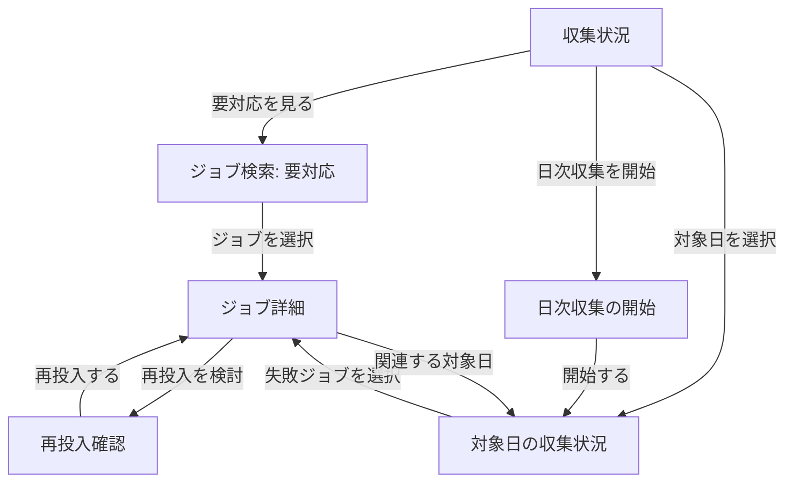

# 管理サイト UI / UX 再設計

## 1. 目的と今回の範囲

この文書は、管理サイトをスマートフォンでも「状況を把握し、原因を確認し、安全に復旧できる」画面へ再設計するための構成案である。今回は実装前の情報設計、画面遷移、API 要件、デザインシステム、Blazor 実装方針までを決める。

- レース、予想、馬、騎手、調教師の情報項目と画面間の関係は原則維持する。
- ジョブ管理は一覧中心の構成を廃止し、運用ユースケース中心に再設計する。
- `HorseRacingPrediction.Api` を管理サイトの正本とし、`HorseRacingPrediction.Collector` の画面は収集処理のデバッグ用途に限定する。
- 最小対応幅は 320 CSS px、主要なタップ対象は 44 px 以上をプロジェクト基準とする。WCAG 2.2 の最低要件は 24 x 24 CSS px である。

## 2. 現状の問題

### 2.1 直接の不具合

`CollectionTasks.razor` と Collector の `Jobs.razor` / `ResultDays.razor` は、幅の大きい `<table>` の最終列に再投入ボタンを置いている。一方、テーブルを横スクロールさせる専用コンテナがないため、スマートフォンでは右端の操作へ到達できない。

`.card` だけにはモバイル時の `overflow-x: auto` があるが、対象テーブルは `.card` に含まれていない。単にテーブルへ横スクロールを加えると操作自体は可能になるものの、キー、日時、状態、ボタンを横移動しながら読む必要が残り、運用画面としては不十分である。

### 2.2 情報設計上の問題

- 「今、対応が必要か」が一覧を読まないと分からない。
- `Failed`、`DeadLetter`、`WaitingDependency` などの意味と次の行動が表示されない。
- 再投入できる状態かに関係なく、全行に同じ操作が表示される。
- 最終エラーとペイロードは別画面または別サービスにあり、復旧判断までの経路が分断されている。
- ジョブ単体の再投入と、対象日の Discovery / Collection 再投入の違いが運用者の言葉で説明されていない。
- 同じジョブ管理 UI が API と Collector に重複し、振る舞いと表示がずれやすい。
- フィルターが実装上の値 (`JobType`, enum 名) をそのまま見せている。
- 件数上限だけでページング、総件数、状態別件数がなく、検索結果の全体像が分からない。
- 再投入の確認、理由、実行者、監査履歴がない。

## 3. 運用ユースケース

ジョブ管理は API のエンドポイント単位ではなく、次の利用目的で構成する。

1. **異常に気づく**: 失敗、デッドレター、長時間実行、依存待ちの件数と最新発生時刻を見る。
2. **影響範囲を知る**: 対象日、レース、処理種別、後続処理への影響を確認する。
3. **原因を確認する**: 人が読めるエラー要約、詳細、試行回数、ペイロード、時系列を見る。
4. **復旧方法を選ぶ**: ジョブ単体、日次 Discovery から、日次 Collection から、のいずれかを選ぶ。
5. **安全に再投入する**: 対象と副作用を確認し、二重送信を防いで実行する。
6. **復旧を追跡する**: 再投入後の新しい状態と関連ジョブを同じ画面で追跡する。
7. **正常系を調べる**: 種類、状態、対象日、更新時刻で検索し、個別ジョブを参照する。

## 4. 推奨する情報アーキテクチャ

管理サイトの主ナビゲーションを次の 3 グループに整理する。

- **レース**: レース、予想票
- **データ**: 馬、騎手、調教師
- **運用**: 収集状況、ジョブ

デスクトップでは左サイドバー、720 px 以下では上部アプリバーとドロワーメニューを使用する。モバイルで全メニューを常時折り返して表示しない。画面内のローカルナビゲーションはタブまたはセグメントに分ける。

### 4.1 収集状況 `/operations/collection`

運用の入口。実装用語ではなく、対応の優先順位を示す。

- 要対応: 失敗 / デッドレター / 長時間停止
- 処理中: 実行中 / 待機中
- 最近完了: 直近 24 時間の成功
- 対象日別状況: 完了数 / 予定数、不完全理由
- 主操作: 「要対応を見る」「日次収集を開始」

### 4.2 ジョブ検索 `/operations/jobs`

調査用の全件検索。初期表示は「要対応」で、成功ジョブを大量に並べない。

- クイックフィルター: 要対応、処理中、完了
- 詳細フィルター: 処理種別、状態、対象日、更新期間、キー
- デスクトップ: テーブル表示
- モバイル: 1 ジョブ 1 カード。状態、処理名、対象、相対時刻、エラー要約だけを表示
- 行やカード全体を詳細へのリンクとし、破壊的操作は一覧に置かない

### 4.3 ジョブ詳細 `/operations/jobs/{jobId}`

復旧判断の中心画面。

- ヘッダー: 状態、処理名、対象、更新時刻
- 「何が起きたか」: 最終エラーの要約と詳細
- 「処理の履歴」: 投入、開始、失敗、再投入の時系列
- 「技術情報」: Job ID、Deduplication Key、ペイロード、優先度、リース（折りたたみ）
- 状態に応じた主操作: `再投入を検討`。実行中や成功済みなど、再投入が不適切な状態では表示しない

### 4.4 再投入確認 `/operations/jobs/{jobId}/requeue`

スマートフォンではボトムシート相当、デスクトップではダイアログとして表示できるが、URL を持つページとしても成立させる。

- 対象: 処理名、日付 / レース、キー
- 現在の状態と試行回数
- 実行内容: 既存ジョブを Ready に戻す、試行回数は維持する、直ちに実行候補になる
- 注意: 関連する後続処理や重複可能性
- 任意の再投入理由
- 主操作: `再投入する`、副操作: `戻る`
- 成功後は詳細へ戻し、トーストだけでなく新状態を本文に反映する

### 4.5 日次収集の開始 `/operations/collection/run`

ジョブ種別や ProviderType を直接入力させず、「いつの JRA 結果を収集するか」を入力させる。

- 対象日（必須）
- 開始位置: 通常は「対象日の発見から」。既存ジョブがある場合のみ「収集から再開」を選択可能
- 実行前に既存の日次状態と影響を表示
- 完了後は対象日の状況画面へ遷移

## 5. 画面遷移



ブラウザーの戻る操作でフィルターとスクロール位置を復元する。URL のクエリに主要フィルターを保持し、通知リンクから同じ調査状態へ到達できるようにする。

## 6. API の再構成

### 6.1 既存 API で実現できること

| 利用目的 | 既存 API | 判定 |
|---|---|---|
| ジョブ一覧 | `GET /api/collection/tasks` | 一覧の最小実装は可能 |
| ジョブ詳細 | `GET /api/collection/tasks/{jobId}` | 詳細表示は可能 |
| 単体再投入 | `POST /api/collection/tasks/{jobType}/{deduplicationKey}/requeue` | 操作可能だが URL が技術キー依存 |
| 対象日別状況 | `GET /api/collection/result-days` | 表示可能 |
| 日次再投入 | `POST /api/collection/result-days/{providerType}/{targetDate}/requeue` | Discovery / Collection の選択が可能 |
| 日次収集開始 | `POST /api/collection/result-days/trigger` | 実行可能 |

### 6.2 追加・変更する API

画面が DB ストアを直接呼ぶ形をやめ、管理画面と外部通知が同じ API 契約を使う。既存 API は互換期間を設け、次の運用 API を追加する。

#### `GET /api/admin/operations/summary`

- 状態別件数、要対応件数、最終成功時刻、最終失敗時刻
- 集計時刻と「長時間実行」の閾値
- ダッシュボードを 1 リクエストで描画する

#### `GET /api/admin/jobs`

- `attention`, `status[]`, `jobType[]`, `targetDate`, `updatedFrom`, `query`, `cursor`, `pageSize`
- `items`, `nextCursor`, `totalApproximate`
- 表示用の `displayName`, `targetSummary`, `errorSummary`
- `availableActions` を返し、UI が状態遷移規則を複製しない

#### `GET /api/admin/jobs/{jobId}`

- 現在値に加えて `timeline`, `relatedJobs`, `availableActions`
- ペイロードは既定では除外し、`includePayload=true` のときだけ返す

#### `POST /api/admin/jobs/{jobId}/requeue`

```json
{
  "reason": "JRA 側の一時エラーが解消したため",
  "expectedUpdatedAt": "2026-08-28T01:23:45Z"
}
```

- URL は `jobId` を使用し、ジョブ種別と重複排除キーをクライアントへ再送させない。
- `expectedUpdatedAt` または ETag で、確認後に状態が変化した場合は `409 Conflict` とする。
- 実行者、理由、旧状態、新状態を監査イベントとして保存する。
- 同一リクエストの再送に備え、Idempotency-Key を受け付ける。

#### `POST /api/admin/collection-runs`

```json
{
  "provider": "JRA",
  "targetDate": "2026-08-30",
  "startFrom": "discovery",
  "reason": "欠損レースの再収集"
}
```

- UI からジョブ型名を隠す。
- 既存状態から実行可否と推奨開始位置を検証する。
- `202 Accepted` と追跡先 URL を返す。

### 6.3 状態と操作

| 状態 | 画面上の意味 | 主操作 |
|---|---|---|
| Pending / Ready | 実行待ち | 詳細を見る。通常は再投入不可 |
| Running | 実行中 | 詳細を見る。リース期限超過時だけ要対応 |
| WaitingDependency | 前処理待ち | 依存ジョブを見る |
| Succeeded | 完了 | 原則参照のみ |
| Failed | 失敗 | 原因確認後に再投入可能 |
| DeadLetter | 規定回数失敗 | 高い注意度で再投入可能 |
| Cancelled | 中止 | 中止理由に応じて再投入可能 |

サーバーが `availableActions` を決定し、再投入不可の理由も返す。色だけで状態を表現せず、アイコンと日本語ラベルを併用する。

## 7. レスポンシブ画面テンプレート

### 7.1 App shell

- 1024 px 以上: 240 px の左サイドバー + 最大 1200 px の本文
- 721–1023 px: 縮小サイドバーまたはドロワー + 本文
- 720 px 以下: 高さ 56 px のアプリバー、メニューボタン、現在ページ名
- 本文余白: モバイル 16 px、デスクトップ 24–32 px
- コンテンツ自体に固定幅・画面全体の横スクロールを持たせない

### 7.2 Collection page template

1. ページタイトルと主要操作
2. クイックフィルター / 検索条件
3. 件数と並び順
4. 読み込み中 / 空 / エラー / 結果
5. ページングまたは追加読み込み

デスクトップのテーブルは必要な列に絞り、詳細値は詳細画面へ移す。モバイルでは CSS でテーブルを無理にカード化せず、同じデータから専用の `<JobListItem>` を描画する。

### 7.3 Detail page template

1. 戻るリンク
2. 状態 + 対象 + 更新時刻
3. 次に取るべき操作
4. 判断に必要な内容
5. 時系列
6. 折りたたんだ技術情報

### 7.4 Form / confirmation template

1. 操作内容
2. 対象
3. 入力欄とインライン検証
4. 影響・注意
5. キャンセルと主操作

モバイルでは主操作を幅いっぱいにし、ボタン間に 8 px 以上の間隔を取る。送信中は二重押下を無効化する。

## 8. デザインシステム

デザインシステム名を暫定で **RaceOps UI** とする。競馬情報の閲覧と運用操作で同じ基礎部品を共有する。

### 8.1 デザイントークン

意味ベースの CSS Custom Properties を採用し、具体色をページに直接書かない。

```css
:root {
    --color-canvas: #f7f7f4;
    --color-surface: #ffffff;
    --color-text: #1d2925;
    --color-text-muted: #59645f;
    --color-border: #d7deda;
    --color-action: #176b4d;
    --color-action-hover: #10553c;
    --color-info: #176b87;
    --color-warning: #8a5b00;
    --color-danger: #a12b2b;
    --color-success: #287342;
    --space-1: 0.25rem;
    --space-2: 0.5rem;
    --space-3: 0.75rem;
    --space-4: 1rem;
    --space-6: 1.5rem;
    --radius-control: 0.5rem;
    --radius-surface: 0.75rem;
    --shadow-raised: 0 0.25rem 1rem rgb(20 40 30 / 8%);
    --content-max: 75rem;
}
```

- 色: `canvas`, `surface`, `text`, `border`, `action`, `info`, `warning`, `danger`, `success`
- 余白: 4 px 基準の 1 / 2 / 3 / 4 / 6 / 8
- 文字: 本文 16 px、補助 14 px、見出しは `clamp()` で段階化
- 操作高さ: 標準 44 px、コンパクト表示でも 36 px 未満にしない
- 角丸: コントロール 8 px、面 12 px。ピル形状は状態ラベルだけに限定
- 影: 浮いたレイヤーだけ。全カードへ機械的に付けない
- フォーカス: 2 px の明確なリングを全操作に表示

### 8.2 基礎コンポーネント

- `AppShell`, `AppHeader`, `SideNavigation`, `MobileDrawer`
- `PageHeader`, `Breadcrumbs`, `Section`
- `Button`（primary / secondary / danger / quiet）
- `TextField`, `SelectField`, `DateField`, `FieldError`
- `StatusBadge`, `MessageBanner`, `ToastRegion`
- `FilterBar`, `QuickFilter`, `EmptyState`, `LoadingState`, `ErrorState`
- `ResponsiveCollection`, `DataTable`, `MobileListItem`, `Pagination`
- `DefinitionList`, `Timeline`, `Disclosure`, `ConfirmDialog`
- ジョブ固有: `JobStatusBadge`, `JobListItem`, `JobSummary`, `RequeueForm`

各コンポーネントはラベル、キーボード操作、フォーカス、読み込み中、無効、エラー、空状態を API の一部として持つ。ページ固有 CSS でボタンや入力を上書きしない。

### 8.3 状態表示

- 要対応: 赤 + 警告アイコン + 「失敗」「要確認」
- 注意: 黄 + 時計 / 依存アイコン + 「依存待ち」「再試行待ち」
- 進行: 青 + 進行アイコン + 「実行中」
- 完了: 緑 + チェック + 「完了」
- 中立: グレー + 「中止」など

英語 enum は UI 境界で日本語へ変換し、ログや技術情報だけに原値を表示する。

## 9. Blazor の採用方針

### 9.1 現在地

両 Web UI は `.NET 8` の Blazor Web App 形式で、アプリ全体を `InteractiveServer` にしている。構成自体は現行の Blazor Web App の考え方と一致しており、今回の UI 改修のために WebAssembly へ変更する必要はない。

### 9.2 推奨

- 次の基盤更新で .NET 10 LTS へ移行する。.NET 10 は 2028 年 11 月までサポートされ、.NET 8 は 2026 年 11 月にサポート終了する。
- 当面は Interactive Server を維持する。管理画面は認証済み・低同時接続で、サーバー側 API と同居しているため適合する。
- 静的に表示できる画面まで一律に対話化する必要が生じた場合は、ページ / コンポーネント単位の render mode を検討する。最初の改修では構成変更を混ぜない。
- 大量一覧には公式 `QuickGrid` の `ItemsProvider` + ページングを候補とする。仮想化は行高固定が必要で、モバイルカードと相性が悪いため、数百件規模ではページングを優先する。
- .NET 10 移行後のフォームは `EditForm` + `DataAnnotationsValidator` と組み込みのネスト検証を使い、Minimal API 側でも `AddValidation()` を使う。
- .NET 10 の Blazor メトリクス / トレースを、SignalR 回線切断やイベント処理遅延の運用監視に利用する。

### 9.3 UI ライブラリの判断

Microsoft Fluent UI Blazor は豊富なコンポーネント、デザイントークン、テンプレートを持つ有力候補だが、ASP.NET Core の公式構成要素ではなくベストエフォート保守である。現在の小規模な管理 UI へ全面導入すると、見た目の改善と同時に依存追加・マークアップ置換・アップグレード追従が発生する。

したがって第一段階は、Razor Class Library に RaceOps UI のトークンと少数の基礎コンポーネントを作る。実装スパイクで Fluent UI Blazor の DataGrid、Dialog、Toast、Drawer のアクセシビリティと .NET 10 対応を比較し、採用する場合もページから直接利用せず RaceOps UI の薄いラッパー越しに使う。

## 10. 推奨プロジェクト構成

```text
src/
  HorseRacingPrediction.AdminUi/
    Components/
      Layout/
      Feedback/
      Forms/
      Collections/
      Jobs/
    DesignTokens/
      tokens.css
      foundations.css
    Models/
    Services/
  HorseRacingPrediction.Api/
    Web/Components/Pages/
      Operations/
        CollectionOverview.razor
        Jobs.razor
        JobDetail.razor
        RequeueJob.razor
        StartCollectionRun.razor
```

共有ライブラリは表示と UI 状態だけを担当し、`ProcessingStateStore` を参照しない。ページは型付き `AdminOperationsClient` を介して API を呼び、API の DTO とドメイン / 永続化モデルを分離する。

## 11. 実装順序

### Phase 0: 緊急修正

- 現行テーブルを `.table-scroll` で囲み、画面全体ではなく表だけ横スクロール可能にする。
- 再投入ボタンを先頭付近にも置くか、行全体から詳細へ遷移できるようにする。
- これは恒久 UI とは別コミットにする。

### Phase 1: 基礎

- RaceOps UI のトークン、App shell、Button、Field、StatusBadge、画面状態を実装する。
- モバイルの折り返しナビゲーションをアプリバー + ドロワーに置き換える。
- レース系画面へ App shell だけを適用し、情報項目は変更しない。

### Phase 2: 読み取り導線

- 運用サマリー API、ジョブ検索 API、詳細 API を追加する。
- 収集状況、レスポンシブなジョブ検索、ジョブ詳細を実装する。
- API と Collector の重複画面を整理する。

### Phase 3: 安全な操作

- `jobId` ベースの再投入 API、楽観的同時実行制御、監査履歴を追加する。
- 再投入確認と日次収集開始フローを実装する。
- 通知 URL を新しい詳細画面へ変更する。

### Phase 4: 基盤更新

- .NET 10 LTS へ更新する。
- QuickGrid と Fluent UI Blazor のスパイク結果を反映する。
- Blazor のメトリクス / トレースを運用監視へ接続する。

## 12. 受け入れ基準

- 320 px 幅でページ全体の横スクロールが発生しない。
- 要対応ジョブの発見から再投入完了まで、片手操作で到達できる。
- 一覧を横スクロールしなくても状態、対象、エラー要約、更新時刻が分かる。
- 再投入前に対象と影響を確認でき、二重送信と競合を検出できる。
- すべての操作をキーボードだけで実行でき、フォーカスが視認できる。
- 200% 拡大と 320 CSS px 幅で内容が欠落しない。
- 状態は色だけに依存しない。
- 読み込み中、空、API エラー、回線切断、成功の各状態が定義されている。
- デスクトップでは 100 件の一覧を実用的な速度で操作できる。

## 13. 調査資料

- [ASP.NET Core Blazor tooling / templates (.NET 10)](https://learn.microsoft.com/en-us/aspnet/core/blazor/tooling?view=aspnetcore-10.0)
- [ASP.NET Core Blazor render modes (.NET 10)](https://learn.microsoft.com/en-us/aspnet/core/blazor/components/render-modes?view=aspnetcore-10.0)
- [ASP.NET Core Blazor QuickGrid (.NET 10)](https://learn.microsoft.com/en-us/aspnet/core/blazor/components/quickgrid?view=aspnetcore-10.0)
- [What's new in ASP.NET Core in .NET 10](https://learn.microsoft.com/en-us/aspnet/core/release-notes/aspnetcore-10.0?view=aspnetcore-10.0)
- [Blazor forms validation (.NET 10)](https://learn.microsoft.com/en-us/aspnet/core/blazor/forms/validation?view=aspnetcore-10.0)
- [.NET releases and support](https://learn.microsoft.com/en-us/dotnet/core/releases-and-support)
- [Microsoft Fluent UI Blazor](https://github.com/microsoft/fluentui-blazor)
- [WCAG 2.2 target size](https://www.w3.org/WAI/WCAG22/Understanding/target-size-minimum.html)
- [WCAG reflow](https://www.w3.org/WAI/WCAG21/Understanding/reflow)
