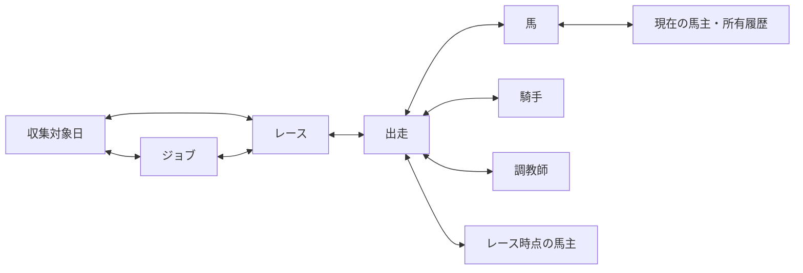

# 管理情報をシームレスに辿る UI

- Status: Approved
- Owner: HorseRacingPrediction
- Created: 2026-08-29
- Updated: 2026-08-29

## 背景

現行管理画面にはジョブ、収集対象日、レース、出走、馬、騎手、調教師、馬主の情報が存在するが、画面ごとの表示形式や技術用語が強く、関連情報を辿る体験が分断されている。

全体の情報設計は [管理サイト UI / UX 再設計](../../admin-ui-design.md) の OOUI モデルを正本とする。本変更では、その設計を現在の画面へ反映するための表示階層と遷移を確定する。

## 承認対象と関連文書

本変更セットの承認対象は、この README、リンクされたモック一式、および本変更に伴って更新する [管理サイト UI / UX 再設計](../../admin-ui-design.md) の変更箇所とする。共通設計書の変更理由と対応内容は本書の決定・レビューへ記録し、実装は本変更セットの Approved 範囲だけを対象にする。

## 目標

- 利用者が内部 ID や列挙値を理解しなくても、対象と状態を判断できる
- どの詳細画面からでも、関係する収集対象日、ジョブ、レース、出走、人馬情報を文脈付きで辿れる
- ブラウザーの「戻る」だけに依存せず、オブジェクト間を直接移動できる
- 一覧と詳細で対象の呼び方、状態、主要属性の順序を統一する
- 320 CSS px でも主要情報と遷移先を横スクロールなしで利用できる

## 対象外

- 新しいドメインデータの推測による生成
- Collector / Predictor が担うライフサイクル操作の管理画面への移管
- 本変更と同時の .NET 更新または UI ライブラリ導入
- 初期段階でのピクセル単位の外観確定

## 体験と情報階層

すべての詳細画面を次の共通構造にする。

1. 戻り先と現在位置
2. オブジェクト種別、状態、利用者向け名称
3. 対象を識別する文脈（日付、開催場、R など）
4. 判断に必要な主要情報
5. 関連するオブジェクト
6. 履歴または内容の詳細
7. 管理操作、メモ、技術情報

`JobType`、Job ID、Race ID、Deduplication Key、ペイロードなどは通常の見出しから外し、折りたたみ可能な技術情報へ移す。

### レスポンシブなセクション表示

- 720 CSS px より広いデスクトップ表示では、詳細の全セクションを同じページへ見出し付きで連続表示する。情報をタブで隠さない
- 720 CSS px 以下のモバイル表示では、主要セクションをタブに分け、一度に一つのパネルだけを表示する
- プロフィール概要、状態、要確認件数など対象を識別する情報はタブの外に置き、どのタブでも確認できるようにする
- モバイルの既定タブは、そのオブジェクトの主情報とする。馬・騎手・調教師・馬主は履歴、レースは出走馬または結果を既定にする
- 選択タブをURLフラグメントへ反映し、同じセクションへ直接リンクできるようにする。デスクトップでは同じフラグメントの見出しへ移動する
- モバイルのタブは横スクロールに依存させず、320 CSS px で折り返すか、表示数を整理してすべてのラベルを操作可能にする

## ナビゲーションと関係

関連リンクには名称だけでなく、関係の種類と判断材料を表示する。

- ジョブ → 収集対象日: `2026年8月28日の収集`、`19 / 24 レース完了`
- ジョブ → レース: `札幌 9R`、`結果と払戻が未更新`
- レース → ジョブ: `レース結果の収集`、`デッドレター・10:36更新`
- 出走 → 馬・騎手・調教師・馬主: 関係ラベルを添え、各詳細へ直接リンクする
- 人馬詳細 → 出走: レース、結果、相手オブジェクト、関係時点を同じ項目で示す

一覧から詳細へ移動した場合、フィルター、並び順、ページを URL に保持する。詳細から関連オブジェクトへ移動した後も、各ページに現在位置と関係ラベルを表示する。

## 画面別の決定

### ジョブ一覧・詳細

- 一覧の優先順は「要対応、実行中、待機、完了」とする
- 状態、利用者向け処理名、対象、エラーまたは進捗、更新時刻を主要表示にする
- 詳細では問題要約を最初に置き、再投入は確認を伴う主要操作とする
- 親子ジョブを技術的な木構造だけでなく、収集対象日・レースとの関係として表示する

### レース一覧・詳細

- 一覧を開催日、競馬場、レース番号でグループ化する
- レース番号、名称、距離・馬場、頭数、データ状態を主要表示にする
- 詳細は開催前と結果確定後で情報の優先順位を変える
- レースから出走、予想、払戻、収集ジョブへ同一ページ内または直接リンクで移動できる

### 出走と人馬情報

- 出走表と結果表を別物にせず、1頭の参加情報として統合する
- 馬、騎手、調教師、レース時点の馬主をリンクにする
- 馬・騎手・調教師・馬主の詳細では、出走履歴を共通の移動ハブにする
- 現在の関係とレース時点の関係を明示的に区別する

### 馬

- 一覧の主ラベルは登録名とし、性齢、現在の馬主、直近出走を補助情報にする
- 詳細の冒頭にプロフィール、現在の関係、直近成績を置き、出走履歴を関係オブジェクトへのハブにする
- 関係を騎乗した騎手、レース時点の調教師、馬主履歴に分け、回数と最終日を添える
- プロフィール更新、別名統合、データ訂正は閲覧情報から分離した「管理情報」にまとめる
- 1頭あたりの出走数は限定的なため、馬詳細では全出走履歴を取得して日付の新しい順に表示する
- 出走履歴は画面上で最大100件を初回表示し、続きがある場合は `次の100件を読み込む` で段階取得する
- 手動の新規登録は通常UIに置かず、抽出済みデータの補正を管理情報から行う

### 騎手

- 一覧の主ラベルは表示名とし、所属、直近騎乗、騎乗数を補助情報にする
- 詳細では直近騎乗と騎乗履歴を先に表示し、「騎乗した馬」「一緒に出走した調教師」へ移動できるようにする
- 恒常的な担当関係を連想させる表現を避け、出走を根拠とする関係名を使う
- 騎手詳細の初期取得は直近の騎乗10件とし、全履歴を初期ロードしない
- `すべての騎乗履歴を見る` から専用履歴画面へ移動できるようにする
- 手動の新規登録は通常UIに置かず、抽出済みデータの補正を管理情報から行う

### 調教師

- 一覧の主ラベルは表示名とし、所属、直近出走、管理馬の出走数を補助情報にする
- 詳細では管理馬の最近の出走を先に表示し、馬、騎手、レース時点の馬主へ移動できるようにする
- 所属期間がないデータでは「現在の管理馬」と断定せず「出走した馬」と表現する
- 調教師詳細の初期取得は管理馬の直近出走10件とし、全履歴を初期ロードしない
- `すべての出走履歴を見る` から専用履歴画面へ移動できるようにする
- 手動の新規登録は通常UIに置かず、抽出済みデータの補正を管理情報から行う

### 馬主

- 一覧の主ラベルは正規化された表示名とし、出走レース数、出走頭数、最終出走を補助情報にする。所有馬名は同名識別用に常時表示しない
- 詳細は概要、直近出走、関係者、管理情報で構成し、特定の分析だけに用途を限定しない
- 現在の所有関係とレース時点の馬主スナップショットを区別する
- 名寄せと監査履歴は「管理情報」に分離し、通常の閲覧フローを中断させない
- 馬主詳細の初期取得は直近出走10件とし、全履歴を初期ロードしない
- 馬主詳細には所有馬一覧を表示し、各馬は直近出走日の新しい順に並べる。所有馬一覧は馬主検索一覧には表示しない
- `すべての出走履歴を見る` から専用履歴画面へ移動できるようにする
- プロフィール由来の所有者は `現在の馬主`、各出走に保存された所有者は `レース時点の馬主` と表示する
- 馬主は名前ではなく安定した内部 `OwnerId` で識別し、表示名と表記揺れを属性として管理する
- 同名だけを根拠に自動統合しない。外部サイトの馬主 ID が得られる場合は `Provider + ExternalOwnerId` を一意な外部識別子として内部 OwnerId に関連付ける
- 外部 ID が得られず同名を区別できない場合は、誤って統合せず `同一人物か未確認` の確認候補として扱う

### 人物・馬主の全履歴

- 騎手、調教師、馬主の詳細とは別URLの履歴画面を設け、対象名とプロフィールへ戻る導線を保つ
- 日付の新しい順を既定とし、ページングする
- 期間、競馬場、馬名、着順で絞り込めるようにする。騎手・調教師・馬主ごとの追加条件は実データで必要性を確認してから加える
- フィルター、並び順、ページをURLへ保存し、レースや馬の詳細から戻ったときに復元する

### 関係サマリー

- 馬、騎手、調教師、馬主の関係ランキングは全期間を対象にせず、現在日から遡った直近3年間の出走だけから算出する
- 対象期間内の出走・騎乗回数が多い順、同数なら最終関係日の新しい順に並べる
- 詳細画面には上位10件を表示し、`すべての関係を見る` から同じ直近3年間を対象とした専用一覧へ移動できるようにする
- 表示には関係回数、最終関係日、集計期間を添え、現在の恒常的な関係だと誤認させない
- 対象期間より古い出走履歴自体は削除せず、全履歴画面から確認できる。関係サマリーのランキングにだけ含めない

### 一覧に必要な集計値

| 画面 | 現在表示可能 | 追加が必要 |
|---|---|---|
| 馬 | 登録名、性、生年月日、別名数 | 現在の馬主、直近出走、通算出走数 |
| 騎手 | 表示名、所属、別名数 | 直近騎乗、騎乗数、1着数 |
| 調教師 | 表示名、所属、別名数 | 直近出走、管理馬の出走数、1着数 |
| 馬主 | 表示名、出走数、最終出走 | 出走レース数 |

追加集計値が用意できるまで値を推測せず、現在取得可能な属性だけで簡潔に表示する。

### オブジェクト検索

- 馬、騎手、調教師、馬主の通常検索は、表示名、正規化名、登録済みの別名・表記揺れを一つの入力欄から横断検索する
- 別名または表記揺れに一致した結果には、`「○○」に一致` のように一致理由を補足表示する
- 大文字小文字、全角半角、空白など正規化で吸収できる差を検索条件へ要求しない
- 内部 ID と外部 ID は通常検索のラベルへ含めず、詳細条件の完全一致検索として提供する
- 検索条件の有無にかかわらず、馬、騎手、調教師、馬主の検索結果は保存済み表示名の文字列順（昇順）を既定とする。読み仮名順にはしない。同名の場合だけ内部の安定したキーで順序を固定する
- 検索条件として活動期間の開始年・終了年を指定できる。期間はプロフィールの登録日ではなく、出走・騎乗・管理・馬主関係がその年範囲に1件以上あるかで判定する
- 活動期間は初期状態では未指定とし、全件を表示する。3年間などの期間を暗黙の初期条件にしない
- 開始年または終了年だけの指定を許可し、未指定側は利用可能な最古・最新年までとする。開始年が終了年を超える場合は検索せず入力エラーを表示する
- 年指定は通常の検索欄を圧迫しないよう「詳細条件」の開閉内に置く。「出走・騎乗・管理などの実績がある年」という補足を添え、適用中は検索結果上部に `活動期間: 2020–2024` のチップを表示し、1操作で解除できるようにする
- 詳細条件は適用後も開いたままにし、入力中の値と適用済みの値をその場で確認できるようにする。開閉状態はリロード時に復元しない
- 年の入力中は検索を自動実行せず、「検索」または「条件を適用」を押した時点で結果を更新する
- 検索条件、並び順、ページを URL に保持する
- 検索結果は1ページ50件の通常ページングとし、無限スクロールを使用しない。デスクトップとモバイルで同じ件数にする
- 総件数、現在表示している範囲、現在ページ、総ページ数を表示する
- 検索画面の再実行は `検索` ボタンで行い、検索結果がない状態に `再抽出` ボタンを表示しない。更新ボタンはジョブや収集状態など外部状態の更新確認が必要な詳細画面に限って置く
- 検索中は既存の結果を保持したまま、結果領域上部に共通の読み込み状態を表示する。取得完了後に結果を差し替え、空状態・エラー状態では結果領域を更新する
- 検索・参照 API のエラーは標準エラー状態と `再試行` で表示し、訂正・再投入・名寄せなど変更アクションのエラーはより強いページ内警告として表示する

#### 変更アクションエラーの表示

- 基本はフォーム上部（操作ボタンより上）に、赤色系のページ内エラーパネルを表示する。トーストだけにはしない
- パネルには「訂正を保存できませんでした」のように操作名を含む見出し、対象名、発生時刻、状態（`変更されていません` / `結果を確認してください`）を表示する
- 次の行動を明示する。再試行可能な場合は主ボタンを `もう一度試す` とし、補助操作として `入力を確認する` または `最新状態を確認する` を置く
- サーバーで結果が確定していないタイムアウト時など、利用者の確認なしに次の操作へ進むと二重更新を招く場合だけ、補助的にアラートダイアログで確認を求める。ダイアログを閉じてもフォーム上部の警告は残す
- エラーは `role="alert"` で読み上げ対象にし、入力内容・対象・画面位置を保持する。解消するまでパネルを表示し続ける
- 結果不明エラーは変更処理で想定外の API エラーが発生した場合だけとし、再試行ボタンは表示しない。フォーム送信中は同じ画面に留め、エラー確定後は元の詳細画面へ戻って警告を表示する

### 詳細画面内の並び順

- 出走、騎乗、関連ジョブなど日時を持つ履歴は新しい順にする
- 関係サマリーは直近3年間の関係回数が多い順、同数なら最終関係日の新しい順にする
- 別名・表記揺れは主別名を先頭にし、その後を種別、表示値の順にする
- 要確認は未対応、対応中、解決済みの順とし、同じ状態では新しい順にする
- 同じ基準値の項目には安定した識別子を最終ソートキーとして使い、再読込で順序が入れ替わらないようにする

### リンクとクリック範囲

- 馬、騎手、調教師、馬主など単一オブジェクトを表す検索結果は、項目全体をその詳細へのリンクにする
- 出走履歴のようにレース、馬、騎手、調教師、馬主など複数の遷移先を含む項目は、行全体をリンクにせず各オブジェクト名を個別リンクにする
- 矢印やカードの空白だけにリンク機能を持たせず、リンク先が分かるテキストを含める
- リンクの入れ子を作らず、キーボードフォーカスと読み上げ名から遷移先が判別できるようにする

### データ品質と再抽出

- 利用者が馬、騎手、調教師、馬主の対象全体だけでなく、`馬主名`、`生年月日`、特定出走の `騎手` など個別項目へ `要確認` を設定できるようにする
- 対象の見出しには未解決の要確認件数を `要確認 2件` のように集約表示し、選択すると該当項目を確認できるようにする
- 要確認には対象、理由、設定者、設定時刻、対応状態を記録する。自由記述だけでなく、`表記`、`関係`、`欠損`、`更新されない`、`その他` の理由分類を持たせる
- 要確認から再抽出または訂正へ移動するときは、対象オブジェクト、対象項目、理由を引き継ぐ
- `再抽出する` は値を直接修正する操作と分離し、元ページまたは対象レースの収集ジョブを確認してから投入する
- 再抽出後も要確認を自動解除しない。再抽出前後の値または更新時刻を確認し、人が解決済みにする
- 同じ対象の再抽出が実行中または待機中なら、新しい投入を作らず関連ジョブへ案内する

機械判定は品質の断定ではなく、人が確認する候補を提示する補助情報とする。候補には理由と根拠を必ず表示する。

- 必須項目が欠けている、または直近の同種データより項目数が大きく減った
- 同じ外部 ID に異なる正規化名が割り当てられた
- 同じ正規化名に複数の内部オブジェクトが存在する
- レースの出走頭数と取得した出走数、結果数が一致しない
- 出走に紐づく馬、騎手、調教師が参照できない
- 生年月日、性別、開催日、着順などにドメイン上成立しない組み合わせがある
- 同じ原文を再抽出した結果が前回値と変わり、変更理由をソースの更新として説明できない
- 最終出走があるのに、一定時間を過ぎても関連プロフィールまたは結果が更新されない

自動候補は `確認候補` と表示し、人が設定した `要確認` と同じ強さで警告しない。

### データ補正

- プロフィール更新とデータ訂正を分けず、`データを補正する` 操作へ統合する
- 補正フォームは詳細画面内に展開せず、`/<objects>/{id}/edit` の専用画面へ移動する
- 補正画面には対象の名称と現在値を表示し、保存またはキャンセル後は元の詳細画面へ戻す
- 補正理由は任意入力とし、入力を保存条件にしない
- 補正時は変更前後の値、実行者、日時、任意の理由をドメインイベントとして必ず記録する
- 補正イベントと補正履歴は管理画面から閲覧する情報に含めない。現在値だけを通常画面に表示する
- 再抽出、データ補正、別名統合、馬主名寄せは別の操作として扱う

## モック

- [ジョブ一覧・詳細](mocks/jobs.md)
- [レース一覧・詳細と出走](mocks/races-and-entries.md)
- [オブジェクト間の移動](mocks/object-navigation.md)
- [馬の一覧・詳細](mocks/horses.md)
- [騎手の一覧・詳細](mocks/jockeys.md)
- [調教師の一覧・詳細](mocks/trainers.md)
- [馬主の一覧・詳細](mocks/owners.md)
- [状態別・レスポンシブ補助モック](mocks/edge-states.md)

モックは情報階層と操作を確認するためのワイヤーフレームであり、最終的な色、余白、タイポグラフィは実装時の共通デザイントークンで調整する。

レスポンシブなセクション表示の一般ルールは [管理サイト UI / UX 再設計](../../admin-ui-design.md#104-レスポンシブな詳細セクション) を正本とする。

## 技術的な影響

- API と Collector に重複するジョブ画面の正本を決める必要がある
- JobType、状態、競馬場コードなどを利用者向け表現へ変換する共通プレゼンテーション層が必要
- ジョブから収集対象日・レースを確実に参照するには、文字列キー解析ではなく ReadModel の明示的な関連が望ましい
- 一覧状態を復元するため、フィルターとページングをクエリ文字列へ反映する
- 出走を介した相互リンクでは、レース時点の ID がない関係をリンク可能と断定しない
- 手動の要確認、確認候補、対応状態、理由、監査情報を保持する品質 ReadModel が必要になる
- 再抽出では元データと収集ジョブの対応、および重複投入を防ぐ実行中ジョブ参照が必要になる
- 参加履歴 API は、馬では日付降順で最大100件を初回返却し、続きがあれば次の100件を段階取得できるようにする。騎手・調教師・馬主では日付降順の上限10件を指定できるようにする
- 騎手・調教師・馬主の全履歴 API には、総件数、ページング、期間、競馬場、馬名、着順の検索条件が必要になる
- 関係サマリー API には現在日から3年前の集計開始日、上限10件、回数降順・最終日降順の安定した並び順が必要になる
- オブジェクト検索 API には正規化済みの表示名・別名索引、一致した値と種別、詳細条件のID完全一致が必要になる
- オブジェクト検索 API の既定順は保存済み表示名の文字列昇順とし、詳細 ReadModel は履歴、関係、別名、要確認をそれぞれ定義済みの順序で返す
- オブジェクト検索 API は1ページ50件を既定とし、総件数を返す
- オブジェクト検索 API は活動期間の開始年・終了年を受け取り、対象オブジェクトに期間内の参加実績があるかを検索する
- 現在の馬主実装は正規化名のハッシュから OwnerId を生成するため、同じ正規化名を同一オブジェクトへまとめる。安定した内部 Owner エンティティと、`Provider + ExternalOwnerId`、表示名、別名を分離する移行が必要になる
- レース時点の原文スナップショットは変更せず、解決できた OwnerId を別の参照として保持する。解決不能または同名競合時は null と候補情報を保持する
- データ補正コマンドは理由を nullable とし、変更前後の値、実行者、日時を持つ補正イベントを保存する。補正履歴用の画面 ReadModel は作成しない

## 決定

- 馬・騎手・調教師・馬主画面の主目的は、レースと関係オブジェクトを調べて辿ることとする。データ補正、別名統合、名寄せは副次的な目的として「管理情報」に集約する
- 馬・騎手・調教師の手動新規登録は通常UIから除外する。検索結果がない場合も新規登録や再抽出を促さず、検索条件の解除と条件変更を案内する
- 抽出品質に問題がある場合は、閲覧中の対象と問題箇所を保ったまま訂正または名寄せへ移れる導線を表示する。通常時に編集フォームを常時展開しない
- 品質上の注意は対象項目の近くに表示し、単なる未取得、表記揺れ候補、関係の不整合、訂正済みを区別する
- 品質判断の正本は人が設定する `要確認` とする。機械判定は根拠を伴う `確認候補` に限定し、自動でデータを不正と断定しない
- 要確認は個別項目に設定し、対象全体には未解決件数を集約表示する
- 再抽出、直接訂正、名寄せを別操作として扱い、再抽出後の要確認解除は人が行う
- 検索・参照エラーと変更アクションエラーを同じ通知レベルにせず、変更アクションは結果と次の行動をページ内に残す
- 通常の変更アクションエラーはフォーム上部のページ内エラーパネルで表示し、結果不明時だけアラートダイアログを補助的に使う。ダイアログを閉じてもページ内警告は残す
- 馬の出走履歴は全件、騎手・調教師・馬主の初期履歴は直近10件を取得する
- `現在の馬主` と `レース時点の馬主` をラベルで区別する。馬主は安定した内部IDで管理し、同名だけでは統合しない
- 馬主画面は出走履歴、馬、調教師、騎手、名寄せなどの一般的な調査に利用できる構造を保つ
- 手動変更は `データを補正する` に統合し、理由は任意とする。補正イベントは永続化するが画面には表示しない
- 馬主詳細では所有馬一覧を表示し、直近出走日の新しい順に並べる。馬主検索一覧には所有馬名を表示しない
- データ補正は専用画面で行い、詳細画面には管理操作への入口だけを置く
- 騎手・調教師・馬主では直近10件の後に全履歴への導線を表示し、全履歴画面の検索状態をURLで保持する
- 関係サマリーは現在日から直近3年間の出走だけを対象に回数順・同数なら最終関係日順で上位10件を表示し、全期間の関係を固定表示しない
- 通常検索は正式名・正規化名・別名・表記揺れを横断し、内部ID検索は詳細条件へ分離する
- 活動期間は詳細条件の開閉内で指定でき、適用中の年範囲を結果上部に表示する
- 条件適用後も詳細条件は開いたままで、リロード後は既定の開閉状態に戻る。検索条件の値だけをURLから復元する
- 開始年・終了年を入力している途中には結果を更新せず、明示的な適用操作後に一度だけ検索する
- 活動期間は日本時間で判定し、実績年が不明なレコードは期間検索の対象に含めない。将来年は実績が存在する場合だけ対象にする
- 検索一覧は表示名順、詳細画面内は履歴・関係・別名など情報の意味に適した順序を使う
- 検索結果はデスクトップ・モバイルとも1ページ50件でページングし、ページ番号をURLに保持する
- 検索中も直前の結果が保持され、結果領域上部に読み込み状態が表示される。完了後に結果・空状態・エラーのいずれかへ更新される
- 検索・参照エラーでは条件を保持した再試行ができ、変更アクションのエラーではページ内に警告が残り、再試行可否と次の行動が分かる
- 通常の訂正・再投入・名寄せ失敗はフォーム上部に残り、タイムアウト等の結果不明時はダイアログ確認後も警告と対象・入力内容が保持される
- 管理対象を独立したページの集合ではなく、相互に関係するオブジェクトとして扱う
- 詳細画面の「関連するオブジェクト」を主要セクションにする
- 単一オブジェクトの検索結果は項目全体を詳細への導線とし、複数の遷移先を含む履歴は各名称を個別リンクにする。状態変更操作は詳細に集約する
- 技術情報は削除せず、通常情報から分離する
- デスクトップは見出しによる連続表示、モバイルはタブ表示とし、同じURLフラグメントでセクションを指定する

## 受け入れ基準

- 馬・騎手・調教師の一覧と空状態に手動新規登録フォームまたは主要登録ボタンが表示されない
- 検索結果がない場合、「検索結果がありません」と条件変更・解除への導線が表示され、再抽出ボタンは表示されない
- データ補正を理由未入力でも保存でき、変更前後の値、実行者、日時がイベントとして記録される
- 詳細画面に補正フォームが常時表示されず、補正専用画面の保存またはキャンセル後に同じ対象の詳細へ戻る
- 補正履歴または補正イベントの一覧が管理画面に表示されない
- 閲覧だけを行う利用者は、登録・訂正・名寄せフォームを通過せずに一覧、詳細、関連オブジェクトを移動できる
- 抽出品質の問題が表示された対象では、問題のある項目と対象を引き継いで対応する管理操作へ移動できる
- 品質上の注意がない通常画面では、管理フォームが主要情報より先に表示されない
- 利用者が対象または項目へ理由付きの要確認を設定し、未対応・対応中・解決済みを追跡できる
- 個別項目の要確認から、対象と理由を失わずに再抽出または訂正へ移動できる
- 確認候補には機械判定の根拠が表示され、手動の要確認と見分けられる
- 再抽出前に対象と関連ジョブを確認でき、同じ対象の処理が実行中の場合は重複投入されない
- ジョブ詳細から、存在する収集対象日、対象レース、親子ジョブへ直接移動できる
- レース詳細から、関連ジョブ、すべての出走馬、騎手、調教師、リンク可能な馬主へ移動できる
- 馬・騎手・調教師・馬主の詳細から、出走履歴を介してレースと関係オブジェクトへ移動できる
- 関連リンクには「親ジョブ」「対象レース」「騎手」など関係の意味が表示される
- 一覧と詳細で同じ状態名と利用者向けオブジェクト名を使用する
- 未取得、該当なし、未確定、値なしを同じ空表示にしない
- 320 CSS px および 200% 拡大でページ全体の横スクロールが発生しない
- 720 CSS px より広い画面では全セクションが見出し付きで表示され、720 CSS px 以下ではタブで一つずつ表示される
- モバイルで共有されたタブ付きURLを開くと該当タブが選択され、デスクトップでは該当見出しへ移動する
- キーボードだけで全リンクと操作へ到達でき、フォーカスが視認できる
- 検索結果の項目全体から詳細へ移動でき、履歴行ではレース、馬、騎手、調教師、馬主の各リンクを誤操作なく選べる
- 読み込み、検索結果なし、部分取得、通信エラーを区別して表示する
- Job ID、Race ID、内部 enum、ペイロードは必要な場合に技術情報から確認できる
- 馬詳細には全出走履歴を日付降順で段階取得でき、初回応答は100件までとする。騎手・調教師・馬主詳細の初期応答には直近10件を超える履歴を含めない
- 馬詳細は初回100件を表示し、続きがある場合に次の100件を追加取得できる
- 騎手・調教師・馬主の全履歴をページングでき、期間、競馬場、馬名、着順で絞り込める
- 全履歴からレースまたは馬へ移動して戻った際、適用中の条件とページが復元される
- 関係サマリーに集計期間が表示され、期間外の古い関係が上位10件へ残り続けない
- 別名または表記揺れで対象を検索でき、結果に一致した別名が表示される
- 通常検索のラベルに内部ID入力を要求する表現がなく、詳細条件ではIDを完全一致検索できる
- 馬・騎手・調教師・馬主の検索結果が表示名順で安定し、詳細画面の履歴は新しい順、関係は直近3年間の回数順で表示される
- 50件を超える検索結果をページ移動でき、詳細から戻った際に元のページと検索条件が復元される
- 開始年・終了年を指定して期間内に活動実績のある対象へ絞り込め、年範囲と検索条件がURLから復元される
- 詳細条件が開いたまま適用済みの活動期間を確認・変更でき、リロード後に開閉状態を復元しない
- 年の入力途中に自動検索が走らず、明示的な適用操作で結果が更新される
- 活動期間は日本時間で判定され、実績年不明のレコードは期間検索に含まれない
- 馬主詳細では所有馬が直近出走日の新しい順に表示され、馬主検索一覧には所有馬名が表示されない
- 変更処理の想定外 API エラーではフォーム送信中に画面遷移せず、再試行なしで元の詳細画面へ戻り、結果不明の警告を確認できる
- 表示名が同じ馬主でも、異なる外部IDまたは人が別人と確認した場合は別の OwnerId として保持できる
- レース時点の馬主原文を保持したまま、解決済みの OwnerId から馬主詳細へ移動できる

## 進め方

1. 本 change record とモックを確定する
2. 共通の表示語彙、状態バッジ、関連オブジェクト項目を実装する
3. ジョブ一覧・詳細を変更する
4. レース一覧・詳細と出走表示を変更する
5. 馬・騎手・調教師・馬主へ共通の関係表示を展開する
6. レスポンシブ、アクセシビリティ、画面遷移、回帰テストを行う
7. 検証結果と設計との差分を本書へ記録する

## 検証記録

- `dotnet build src/HorseRacingPrediction.Api/HorseRacingPrediction.Api.csproj -c Debug`
- `dotnet test tests/HorseRacingPrediction.Api.Tests/HorseRacingPrediction.Api.Tests.csproj -c Debug --no-restore`
- `git diff --check`

いずれも成功した。

## 設計レビュー（2026-08-29）

実装前レビューで、次の未確定事項と仕様上の不整合を確認した。いずれも本書または正本の設計を更新してから `Approved` に進める。

1. **検索中の旧結果保持（確定）**: 旧結果を保持し、結果領域上部に読み込み状態を表示する案Aを採用する。取得完了後に一覧を差し替え、空状態・エラー状態では結果領域を更新する。
2. **モックの状態網羅（対応済み）**: 状態別・レスポンシブ別モックを `mocks/edge-states.md` に追加した。

## 差分と後続作業

- 一覧画面の新規登録導線は削除したが、詳細画面内の管理操作は次工程で専用画面へ切り出す余地がある
- 馬・騎手・調教師・馬主の詳細ページは段階取得と旧結果保持を実装したが、設計書にあるモバイルのタブ化はまだ未着手である
- 変更アクションのエラー表示方針は設計に合わせて文書化したが、専用エラーパネルの共通化は後続で行うと保守しやすい

### 将来のデータ分析メモ

同一レースに同じ馬主から3頭出走している場合、いずれかが1着になりやすいという仮説を検証する用途が考えられる。今回のUI変更には含めず、分析機能を企画するときに指標、比較条件、画面配置を判断する。

検討時には OwnerId と RaceId で出走をまとめ、`1頭`、`2頭`、`3頭`、`4頭以上` の各区分について、対象レース数といずれかが1着になったレース数を比較できる。少数標本、期間、競馬場、グレード、有力馬主であることによる交絡を考慮し、因果関係を断定しない。

この分析を可能にするため、今回の馬主ID設計では同名だけで統合せず、レース時点の出走と安定した OwnerId の関係を保持できるようにする。
