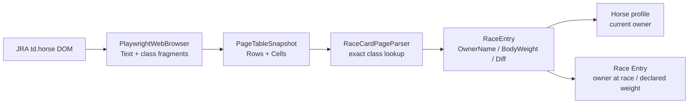

# JRA出馬表の馬主・馬体重取得修正

- Status: Implemented
- Owner: HorseRacingPrediction maintainers
- Created: 2026-09-08
- Updated: 2026-09-08

## Context

JRA出馬表から取得した馬主名と馬体重が保存結果へ正しく反映されない。2026-09-08に実サイトの
出馬表（2026-09-06 中山1R）をPlaywrightで取得し、文字列snapshotと対象セルの`outerHTML`を確認した。

対象セルは次の意味構造を持つ。

```text
馬名:       ヴェストラン                 class=name
単勝オッズ: 28.0                         class=odds / num
人気:       (6番人気)                    class=pop_rank
馬体重:     448kg(0)                     class=weight / transition
馬主:       中西 宏彰                    class=owner
生産者:     (有)ケンブリッジバレー       class=breeder
調教師:     本田 優(栗東)                class=trainer / division
```

ユーザー提示例の正しい対応は、馬主=`藤田 晋`、生産者=`ノーザンファーム`、
調教師=`武 幸四郎`、馬体重=`488`、増減=`-2`である。

現行処理には三つの問題がある。

1. `PlaywrightWebBrowser.GetCellTextAsync`は改行を保持するものの、CSS classを捨てて文字列だけを返す。
2. `RaceCardPageParser.ParseHorseNameCell`は数値だけのオッズ行（例:`28.0`、`10.7`）を除外しないため、
   「調教師以外の最初の候補」を馬主として選ぶ処理がオッズを馬主名にする。
3. parserは`448kg(0)`を除外するだけで`RaceEntry`へ格納せず、workflowも
   `declaredWeight`/`declaredWeightDiff`を常にnull、出走登録の`ownerName`も未指定で送信する。
   別途行う馬プロフィール更新だけでは、レース時点の馬主を表すEntryへ保存されない。

## Goals

- 馬名複合セルから馬主、生産者、調教師、馬体重、増減を混同せず抽出する。
- 馬体重と増減をレース出走の`DeclaredWeight`/`DeclaredWeightDiff`へ保存する。
- 馬主名を馬プロフィールとレース時点の出走スナップショットの両方へ保存する。
- DOMの意味情報が得られる実ブラウザーと、文字列だけの既存fixture/fake browserの双方を扱う。

## Non-goals

- 生産者を新しいドメインオブジェクトとして保存すること。
- 単勝オッズ・人気の永続化。
- RaceResultからの馬主復元。
- JRA以外のprovider向けselector追加。

## Documentation updates

- `docs/23-jra-scraping-redesign.md`: 汎用セルfragment metadataの責務、RaceEntryの馬主・馬体重、
  `AssignedWeight`との区別、馬主の二箇所保存を現在の設計として追記。本変更後のcanonical sourceとする。
- `docs/22-collector-design.md`と`docs/10-domain-design.md`を確認。Collector/API境界と時点付き馬体重の
  原則は既に記載されており、追加変更は不要。

## Technical impact

### Browser snapshot

- `PageTableSnapshot`へ、既存`Headers`/`Rows`を壊さない任意のセルmetadataを追加する。
- metadataはセルの正規化済み全文と、子孫要素のtag名・class token・正規化済みテキストを保持する。
- `PlaywrightWebBrowser`はDOMのclassを意味解釈しない。JRA固有の`owner`等を条件分岐に書かない。
- fragment数・文字数には上限を設け、前走欄など深いDOMでsnapshotが過大にならないようにする。
- `innerText`による改行付き`Rows`は後方互換用として維持する。

#### 追加するsnapshot API

既存の`PageTableSnapshot.Headers`と`Rows`は変更しない。第3引数として、`Rows`と同じ行列位置を持つ
`Cells`を任意追加する。既存fixtureの`new PageTableSnapshot(headers, rows)`はそのままコンパイルできる。

```csharp
public sealed record PageTableSnapshot(
    IReadOnlyList<string> Headers,
    IReadOnlyList<IReadOnlyList<string>> Rows,
    IReadOnlyList<IReadOnlyList<PageTableCellSnapshot>>? Cells = null)
{
    public PageTableCellSnapshot? GetCell(int rowIndex, int columnIndex);
}

public sealed record PageTableCellSnapshot(
    string Text,
    IReadOnlyList<PageDomTextFragment> Fragments)
{
    // class属性を空白で分割したtokenと完全一致する最初のfragmentを返す。
    // `name`が`name_line`へ誤一致しないよう部分一致はしない。
    public PageDomTextFragment? FindByClass(string classToken);
}

public sealed record PageDomTextFragment(
    string TagName,
    IReadOnlyList<string> ClassTokens,
    string Text);
```

`Rows[row][column]`と`Cells[row][column].Text`は同じ正規化結果にする。`Cells=null`は
fake browserや従来fixtureがDOM情報を持たないことを表す。空の`Fragments`はDOMセルは取得したが
class付き子要素がないことを表す。この二つを区別する。

#### PlaywrightでのDOM抽出

`ExtractTableRowsAsync`は文字列とmetadataを別々にDOM走査せず、各`td`/`th`を1回evaluateして
両方を同時に構築する。概念コードは次の通り。

```csharp
private sealed record CellDomResult(string Text, IReadOnlyList<DomFragmentResult> Fragments);

private async Task<PageTableCellSnapshot> ExtractTableCellAsync(ILocator cell)
{
    var result = await cell.EvaluateAsync<CellDomResult>("""
        cell => {
          const normalize = value => (value ?? '')
            .replace(/\r/g, '')
            .split('\n')
            .map(line => line.replace(/\s+/g, ' ').trim())
            .filter(Boolean)
            .join('\n');

          return {
            text: normalize(cell.innerText),
            fragments: [...cell.querySelectorAll('[class]')]
              .slice(0, 48)
              .map(element => ({
                tagName: element.tagName.toLowerCase(),
                classTokens: [...element.classList].slice(0, 8),
                text: normalize(element.innerText)
              }))
              .filter(fragment => fragment.text.length > 0)
          };
        }
        """);

    return new PageTableCellSnapshot(result.Text, result.Fragments);
}
```

実装ではセル本文と各fragmentを既存snapshot上限に合わせて切り詰める。class付き子孫をすべて
保持するのは、ブラウザー層が`owner`等のJRA固有classを知らずに済み、別サイトでも同じAPIを
使えるためである。style、onclick、href、data属性、HTML全文は保存しない。今回必要なテキスト構造
だけを保持し、snapshotにスクリプトや不要な属性を混入させない。

JRAセルはこのように変換される。

```csharp
new PageTableCellSnapshot(
    Text: "バニーラビット\n10.7\n(4番人気)\n488kg(-2)\n藤田 晋\nノーザンファーム\n武 幸四郎(栗東)\n...",
    Fragments:
    [
        new("div", ["name"], "バニーラビット"),
        new("span", ["num"], "10.7"),
        new("span", ["pop_rank"], "(4番人気)"),
        new("div", ["cell", "weight"], "488kg(-2)"),
        new("span", ["transition"], "(-2)"),
        new("p", ["owner"], "藤田 晋"),
        new("p", ["breeder"], "ノーザンファーム"),
        new("p", ["trainer"], "武 幸四郎(栗東)"),
        new("span", ["division"], "(栗東)"),
    ]);
```

### RaceCard parser/model

- `RaceCardPageParser`はmetadataがある場合、exact class tokenの`name`、`owner`、`breeder`、
  `trainer`、`weight`、`transition`を優先する。部分一致は使わない。
- metadataがないfixtureでは文字列fallbackを使う。fallbackはオッズ単独行を数値形式で除外し、
  人気・馬体重・血統を除いた並びを、header記載順（馬主/生産者/調教師）として厳格に検証する。
- `RaceEntry`へ`BodyWeight`（int?）と`BodyWeightChange`（int?）を追加する。
- `NNNkg(+N)`、`NNNkg(-N)`、`NNNkg(0)`を解析する。欄自体がない場合はnull、値があるのに
  解析不能な場合は`JraValueParseException`とする。JRAの正式な欠損表記を実データで確認した場合は
  fixtureと仕様へ追加し、推測でnullへ丸めない。

#### Parserがmetadataを使う手順

`ParseEntries`はrow indexを保持して対象セルmetadataを取得し、次の順で解析する。

```csharp
var cell = table.GetCell(rowIndex, horseNameColumnIndex);

var horseNameText = cell?.FindByClass("name")?.Text;
var ownerText = cell?.FindByClass("owner")?.Text;
var breederText = cell?.FindByClass("breeder")?.Text;
var trainerText = cell?.FindByClass("trainer")?.Text;
var weightText = cell?.FindByClass("weight")?.Text;

var horseName = RequireNonBlank(horseNameText, "HorseName");
var ownerName = OptionalTrimmed(ownerText);
var trainerName = ParseTrainerName(trainerText); // divisionを除いて「武 幸四郎」
var (bodyWeight, bodyWeightChange) = ParseBodyWeight(weightText);
```

`breederText`は`ownerText`と取り違えていないことの検証と診断に使う。保存はしない。
metadataが存在するのに`owner`がない場合、他の行を馬主へ推測で繰り上げず`OwnerName=null`とする。
`weight`が存在するのに解析不能なら例外とする。これにより、生産者を馬主へ誤登録するより欠損として
観測できる状態を優先する。

metadataが`null`の場合だけ、既存fixture互換のテキストfallbackを使う。

```csharp
private static readonly Regex OddsOnlyRegex =
    new(@"^\d+(?:\.\d+)?$", RegexOptions.Compiled);

// 10.7 / (4番人気) / 488kg(-2) / 父・母行を除外する。
// 残りを header記載順の owner / breeder / trainer として読む。
```

fallbackでも`10.7`を馬主として採用しない。複合セルなのに必要な境界を特定できない場合は、
誤った馬主を保存せずparser例外にする。単純fixtureのようにセルが馬名だけなら、従来どおり
馬名のみを正常に解析する。

### Workflow/API

- `JraRaceCardCollectionWorkflow`は`UpsertRaceEntryAsync`のowner対応overloadを使用し、
  `OwnerName`、`BodyWeight`、`BodyWeightChange`を同じ出走登録へ渡す。
- 現在馬主を更新する`UpsertHorseWithOwnerAsync`は維持する。出走登録との二つの意味を混同しない。
- 既存Entryに対する再収集がowner/馬体重を更新できるかを確認する。現行APIが既存Entryを即returnして
  更新不能なら、冪等upsertとして更新commandを追加するか、未更新を明示的エラーにする。黙って成功扱いにしない。

#### 値の受け渡し

parser以降は次の値を明示的に渡す。

```csharp
public sealed record RaceEntry(
    int HorseNumber,
    string HorseName,
    int? FrameNumber,
    string? JockeyName,
    decimal? AssignedWeight,
    string? TrainerName = null,
    string? OwnerName = null,
    int? BodyWeight = null,
    int? BodyWeightChange = null);
```

```csharp
await _writeService.UpsertHorseWithOwnerAsync(
    registeredName: entry.HorseName,
    ownerName: entry.OwnerName,
    ...);

await _writeService.UpsertRaceEntryAsync(
    raceId: raceId,
    horseNumber: entry.HorseNumber,
    horseName: entry.HorseName,
    declaredWeight: entry.BodyWeight,
    declaredWeightDiff: entry.BodyWeightChange,
    ownerName: entry.OwnerName,
    ...);
```

前者は馬プロフィールの現在馬主、後者はそのレース時点のEntry snapshotである。両方に同じ取得値を
渡すが、保存先の意味は異なる。

現行`HttpDataCollectionWriteService.UpsertRaceEntryAsync`は既存Entryを検出すると即returnするため、
再取得による馬主・馬体重補完ができない。このchangeでは次のAPIを追加する案を採用する。

```http
PUT /api/races/{raceId}/entries/{entryId}
```

```csharp
public sealed record UpdateCollectedEntryRequest(
    string? JockeyId,
    string? TrainerId,
    int? GateNumber,
    decimal? AssignedWeight,
    string? SexCode,
    int? Age,
    decimal? DeclaredWeight,
    decimal? DeclaredWeightDiff,
    string? OwnerName);
```

新規Entryは既存POSTを使用し、既存EntryはPUTで収集項目を更新する。PUTは手動訂正APIではなく、
同じJRA出馬表を再収集した際の冪等更新である。イベントソーシング側には`EntryCollectedDataUpdated`
（名称は実装時に既存命名へ合わせる）を追加し、Entry read modelの同一要素を置換する。
馬主・馬体重がnullの場合は既存の非null値を消さないpatch semanticsとし、JRA側で明示的削除を
表す正式状態を確認した場合だけ別途clear操作を設計する。

#### 全体の処理フロー



## Decisions

- 推奨案は、ブラウザー層で汎用fragment metadataを保持し、JRA parserがclassの意味を解釈する方式。
  DOM classを`PlaywrightWebBrowser`へ直書きせず、文字列の表示順推測だけにも依存しない。
- 生産者は馬主との位置関係を検証するため抽出するが、今回の保存対象にはしない。
- 馬主は現在プロフィールとレース時点Entryの両方へ保存する。管理UI設計上も両者は別の事実である。

## Acceptance criteria

- 提示例からOwnerName=`藤田 晋`、TrainerName=`武 幸四郎`、BodyWeight=`488`、BodyWeightChange=`-2`を得る。
- 実サイト例からOwnerName=`中西 宏彰`を得て、オッズ`28.0`や生産者名を馬主にしない。
- 法人馬主`(株)ネクストトライ`をそのまま保持する。
- `448kg(0)`、`456kg(+6)`、`488kg(-2)`を正しく分解する。
- optionalな馬体重欄なしと、値あり解析不能を区別する。
- workflowがEntryへOwnerName/DeclaredWeight/DeclaredWeightDiffを渡す。
- 馬プロフィールにもOwnerNameを保存する。
- 実サイトRaceCard E2Eで全Entryの馬主が数値・人気・生産者になっておらず、馬体重が取得できる。
- Browser、RaceCard parser、workflow、Collector/APIの関連テストとソリューションビルドが成功する。

## Delivery plan

1. 汎用table-cell fragment metadataとPlaywright抽出、単体テスト。
2. RaceEntry/RaceCard parserのsemantic優先解析と文字列fallback、fixtureテスト。
3. Workflow/API保存経路と再収集時の既存Entry挙動を修正し、統合テスト。
4. 実サイトE2E、全体ビルド・回帰テスト、検証記録更新。

## Verification record

- 設計調査時に一時診断テストで実サイトsnapshotと対象セル`outerHTML`を取得。診断テストは成果物へ残していない。
- 調査開始時点で`PlaywrightWebBrowser.cs`にユーザー変更（`Headless=false`）があり、変更していない。
- 実装チェックポイント1: 汎用DOM fragment snapshot、class優先parser、文字列fallback、RaceEntryとworkflowの
  値受け渡しを実装。parser/workflow関連15テストと実サイトRaceCard E2E 1テストが成功。
- 実装チェックポイント2: 既存Entryの馬主・馬体重を非null patch semanticsで更新する
  `EntryCollectedDataUpdated`、PUT API、read model反映、Collector呼び出しを実装。Domain 96件、
  Collector HTTP 11件、Scraping関連15件のテストが成功。
- `dotnet build HorseRacingPrediction.sln --no-restore`: 成功（警告0、エラー0）。
- `dotnet test HorseRacingPrediction.sln --no-restore --filter "TestCategory!=External"`: 最終実装で658件成功、失敗0。
  リポジトリ既定値`Headless=true`で検証後、ユーザーの未コミット変更`Headless=false`を復元した。
- `JraSiteE2ETests.現在週RaceCard取得`: 実サイトに対して1件成功（44秒）。全Entryの馬主が非空かつ
  数値ではなく、馬体重が正数であることを検証した。このE2Eはユーザー設定`Headless=false`でも成功した。
- PlaywrightのJavaScript objectをprivate recordへ直接返すと`Return type mismatch`になることが判明したため、
  JavaScript側でJSON文字列化し、.NET側で明示的にデシリアライズする方式へ修正。localhost上のHTMLを
  実ブラウザーでsnapshot化する回帰テストを追加し、DOM fragmentの取得成功を確認した。
- レース一覧を含む既存ページの取得方法を尊重しつつ高速化するため、セルごとのPlaywright呼び出しを廃止し、
  テーブル全体のセル本文・class fragment・`a[href]`を1回のDOM評価で取得する方式へ変更した。
  `RaceListPageParser`はレース番号セルのリンクを`RaceCardUrl`/`ResultUrl`へ保持する。
- 上記変更後、JRA実サイトの`現在週RaceList取得`と`現在週RaceCard取得`を連続実行し、2件とも成功（49秒）。

## Deviations and follow-up

- 設計案の更新DTOは出走登録の全収集項目を列挙していたが、今回の不具合修正に必要な
  `DeclaredWeight`、`DeclaredWeightDiff`、`OwnerName`だけを更新対象にした。騎手・調教師等の既存値を
  変更する要件はなく、履歴read modelへの不要な影響を避けるためである。
- 馬体重の正式な欠損表記は今回取得したレースに現れなかった。実装中に確認できなければ、既知形式だけを
  正常扱いし、未知表記は例外として観測可能にする。
- 生産者の永続化は別change recordで扱う。
